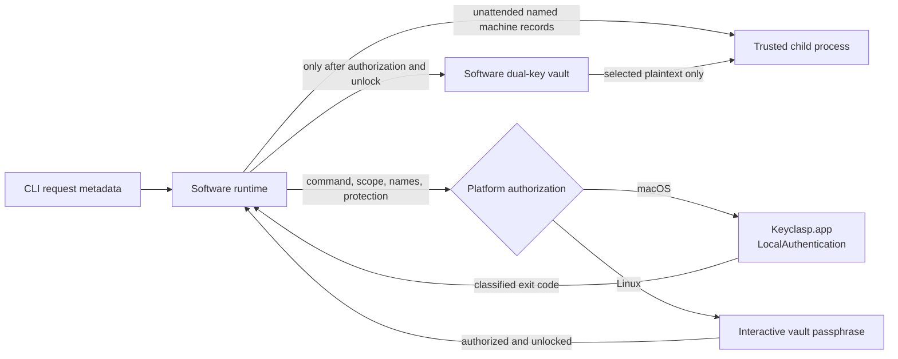

# Operator authorization

Scope: the software-vault operator authorization boundary for macOS and Linux. Hardware mode remains separate and status-only.

Verification basis: the `0.2.0-beta.1` rc6 candidate worktree based on revision `2d486d756a07da64e4cfa8810ca0c3b2d7a44278`, inspected through `src/software/runtime.ts`, `src/run.ts`, `src/biometric.ts`, `native/macos-biometric/main.m`, `native/macos-biometric/Info.plist`, and the focused biometric/runtime/package tests. The exact rc6 artifact and physical receipt are recorded in the release-candidate receipt.

The shared runtime carries scope, command, and secret names but no key or plaintext. On macOS, Node invokes the reviewed executable inside the no-Dock UI-agent `Keyclasp.app` directly, without a shell, `open`, or AppleScript. The helper registers and activates an accessory `NSApplication`, reads one bounded UTF-8 reason from a closed standard-input pipe, and returns a classified exit status. Linux does not execute or import the macOS helper.
