# Operator authorization

Scope: the software-vault operator authorization and trusted-child output-containment boundary on macOS and Linux. Hardware mode remains separate and status-only.

Verification basis: KC-Q01 blocker-remediation implementation `e6e2de43b7d6a4168ab7a16278487fe20eb3b100`, inspected through `src/cli.ts`, `src/runtime.ts`, `src/software/runtime.ts`, `src/run.ts`, `src/biometric.ts`, `src/owner-only-path.ts`, `native/macos-biometric/main.m`, `native/macos-biometric/build-config.json`, `scripts/build-macos-biometric-helper.mjs`, `keyclasp-macos-helper-candidate.json`, the complete source suite, and all eight Linux diagnostic-package cells. Linux supervision now treats zombie-only process groups as terminated while continuing to wait for any live member. Physical authorization was not executed, and this source basis is not a qualification or physical receipt.

```mermaid
flowchart LR
  CLI[CLI request metadata] --> Runtime[Software runtime]
  Runtime -->|unattended named machine records| Selection[Validate exact selection]
  Runtime -->|broad or effectively locked request| Auth{Platform authorization}
  Auth -->|macOS| Verify[Verify helper path, owner, mode and ACL,<br/>manifest, signature, and identity]
  Verify -->|valid; fixed minimal environment| Helper[Keyclasp.app<br/>LocalAuthentication]
  Verify -->|invalid| Block[Block before helper or vault access]
  Auth -->|Linux| Passphrase[One interactive vault passphrase]
  Helper -->|approved| Unlock[Unlock required interactive key]
  Passphrase -->|authorized and unlocked| Selection
  Unlock --> Selection
  Selection -->|selected plaintext only| Child[Trusted supervised process group]
  Child --> Stdout[stdout UTF-8 matcher]
  Child --> Stderr[stderr UTF-8 matcher]
  Stdout -->|clean chunks| Caller[Caller output]
  Stderr -->|clean chunks| Caller
  Stdout -->|selected value| Contain[Redact, stop forwarding,<br/>terminate group, return nonzero]
  Stderr -->|selected value| Contain
```

The shared runtime carries scope, command, and secret names but no key or plaintext. On macOS, every stateful CLI command validates the packaged helper before lifecycle inspection, recovery, migration, or other vault access. Commands that request operator authorization validate it again immediately before executing its inner binary without a shell. Complete selection validation and required operator authorization happen before selected-value decryption or child launch. The helper receives one bounded reason on standard input and only fixed `PATH`, locale, and temporary-directory environment values. Linux does not execute or import the macOS helper.

Before launch, Keyclasp rejects a secret string if converting it to UTF-8 and back would change its value, so the matcher and child receive the same text. Each child output stream then has an independent incremental UTF-8 decoder and matcher. A matcher scans complete selected values before retaining a suffix that is only a possible future prefix. On the first match, Keyclasp forwards the safe prefix and one redaction marker, stops later stdout and stderr forwarding, terminates every process-group member the invoking user can signal, and returns exit code 2 even if the child exits 0. EOF passes through the same matcher. An `EPERM` liveness result is reported as unconfirmed containment, not as successful termination.

The selected child remains trusted. It can transform, store, transmit, indirectly disclose, or privilege-elevate with a value it legitimately receives. Output matching contains accidental exact-value leaks; it is not a malicious-child sandbox, and an unprivileged Keyclasp process cannot kill a descendant the operating system forbids it to signal. Helper path and signature checks catch a damaged or replaced packaged path, but they do not defend against arbitrary code already running as the same user, a modified Keyclasp process, or coordinated replacement of both helper and metadata. The interactive passphrase and operating-system user boundary remain the software trust anchors.
