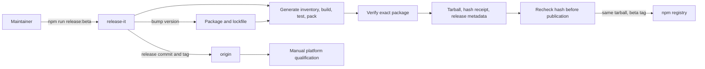

# Software beta release

Scope: maintainer-side release tooling. The installed CLI and vault architecture are unchanged.

Verification basis: source revision `6217c1da0452b3157e5a5a221bc41a9c5931d0ef` plus this working-tree release migration; inspected `.release-it.json`, `scripts/prepare-software-beta.mjs`, the inventory and package verification scripts, and `.github/workflows/software-beta.yml`. Focused tests exercise release-it versioning and hook execution with publishing disabled, failed preparation, and changed-artifact rejection. This is tooling evidence, not a published release receipt.

A failed preparation removes the previous success receipt and prevents the publish hook from passing. Release-it publishes the fixed tarball path with lifecycle scripts disabled; it does not rebuild during publication. Generated metadata is committed with the release. Tarballs and the local success receipt are ignored by Git. The separate manual matrix compares its package against the manifest for the checkout's version; it no longer compares new releases with rc6.

The command requires a clean main checkout and publishes to the beta channel. It does not move latest or complete physical authorization, independent assurance, or operator rollout.
