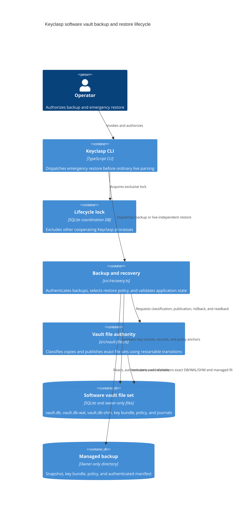

# Software vault lifecycle

Scope: managed software-vault backup, restore, and interrupted-restore recovery. Hardware custody and ordinary secret execution are outside this view.

Verification basis: KC-W01 working tree based on `d94189b30fb5e52ee5f4eb6435e96fe865c13142`; inspected `src/cli.ts`, `src/recovery.ts`, `src/vault-files.ts`, `src/vault.ts`, `src/policy.ts`, `src/lifecycle-lock.ts`, and the focused recovery/lifecycle/authorization tests. The final source check is recorded in the canonical production-readiness plan.

The healthy-live branch first proves that no observable external process holds the SQLite files, captures an exact owner-only DB/WAL/SHM inventory, and copies that complete state into the transaction-owned staging directory. It validates the live key/database/policy relationship and checkpoints committed WAL content only in that stable copy. The raw live file set remains byte-identical until the durable publication journal exists and becomes the exact rollback set. The damaged-live branch never checkpoints the raw live database; it inventories and quarantines DB/WAL/SHM, recognized recovery files, and exact pending-transaction directories only after the backup has passed authentication and full record validation. Busy, changing, newly appearing, or operationally unreadable live files stop before publication and are never treated as damage.

Every v2 restore journal has a transaction-specific authentication key and authenticates its transaction ID, branch, pending-transaction directories, exact staged and previous hashes, and ordered operations. Its deterministic temporary journal and key are either promoted to a durable first journal or removed as recognizable orphans on restart. Staging copies into an exact transaction-owned partial path, verifies and syncs it, and then atomically publishes the staged file. A durable publication journal precedes live renames. Recovery evaluates both endpoints of every rename: an authenticated pre-state may be executed, an authenticated post-state may be recorded as complete, and a mixed or unknown state stops without mutation. Pre-commit recovery walks publication operations backward. It then persists a rollback-cleanup journal before exact unlinks; committed recovery does the same with a committed-cleanup journal. Staging cleanup is journaled too. Observed absence completes an interrupted unlink, so repeated process deaths converge on the complete prior or verified new set.

Before commit, the published database must have no attachable old WAL or SHM, match the journal's authenticated post-publication hashes, pass SQLite `quick_check`, and pass vault identity, bundle generation, key-class inventory, policy-anchor, and every-record AAD/GCM authentication. Tests additionally require `integrity_check` and synthetic canary equality. Synthetic canaries are not part of production restore admission.

The lifecycle lock coordinates Keyclasp processes only. An external SQLite client that ignores the protocol can still race raw files, so operators must stop all such clients before restore. Keyclasp checks observable file holders before classification and again immediately before publication, then rechecks the exact live inventory. `SQLITE_BUSY`, an observable holder, or a file identity change fails closed.
