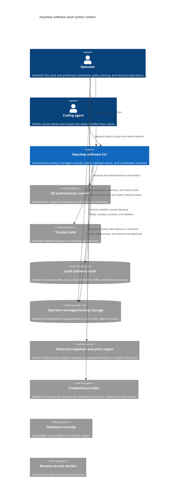

# Software system context

Scope: the current Keyclasp software-vault boundary for interactive and unattended custody, trusted child execution, and managed backups. Native hardware custody remains unavailable.

Verification basis: KC-Q01 blocker-remediation implementation `e6e2de43b7d6a4168ab7a16278487fe20eb3b100`; inspected `src/cli.ts`, `src/platform.ts`, `scripts/install-native-binding.mjs`, `src/policy.ts`, `src/vault.ts`, `src/software/key-bundle.ts`, `src/vault-files.ts`, `src/recovery.ts`, `src/software/runtime.ts`, the complete source suite, and the diagnostic package matrix. The view matches the current combined implementation, including install-time and runtime rejection outside Node 24 and 26. This source basis is not a replacement qualification receipt.

Keyclasp relies on the OS user boundary and on the selected child being trusted. The coding agent works with names and explicit scope; only the trusted child receives values. The software CLI can overwrite buffers it owns, but it does not control JavaScript strings, child environments, OS caches, swap, crash collectors, filesystem snapshots, or copies retained outside the live vault.

Managed-backup authentication proves origin and internal consistency, not freshness. Live-file sanitization and machine-key retirement cannot revoke external snapshots, copied backups, or credentials already used elsewhere. Those copies remain under operator retention policy, and provider-side rotation is the revocation boundary. Hardware custody and any remote secrets service are outside this software system.
