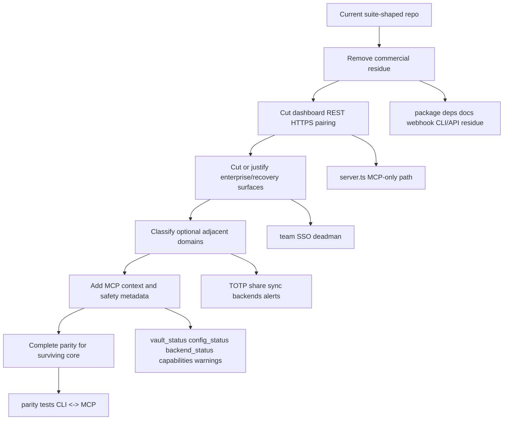

# Agent-Native Core Simplification Plan

## Summary

Simplify Keyblind by finishing commercial residue cleanup, then cutting or isolating non-core web/enterprise/product surfaces before adding agent-native context and parity improvements. The plan deliberately sequences deletion before new MCP capabilities so the team does not harden interfaces for features that should leave the core package.

---

## Problem Frame

The runtime licensing cut improved the vault kernel, but the current package still looks like a suite: MCP server, REST dashboard backend, HTTPS/pairing, SSO/team/deadman, extension/provider scaffolding, and stale paid-feature docs. That breadth keeps agent-native scores misleading: missing CRUD/parity is partly a real agent gap and partly a signal that too many modules are pretending to be core.

---

## Requirements

- R1. Preserve the local encrypted vault + MCP stdio + safe `.env` sandbox/restore product identity.
- R2. Preserve zero-network, zero-telemetry operation for normal local use.
- R3. Delete, move, or explicitly justify non-core surfaces before adding parity/context work for them.
- R4. Remove commercial/premium/product-tier behavior from runtime, docs, dependencies, and local user flows.
- R5. Keep public exports, CLI help, docs, tests, and package dependencies aligned with the surviving product surface.
- R6. Give surviving core user actions equivalent MCP capabilities or documented human-only reasons.
- R7. Add MCP runtime context for initialized state, project/config/backend state, safe vault summary, sandbox summary, recent audit summary, warnings, and capabilities.
- R8. Make MCP safety semantics discoverable: read-only vs destructive, idempotent vs state-changing, secret-sensitive inputs, and session/auth requirements.
- R9. Keep sandbox/unsandbox as domain workflows only if they remain part of the product promise.
- R10. Remove dashboard/REST/HTTPS/pairing from core or promote dashboard to a committed product with event propagation and parity tests.
- R11. Delete/move or justify team vaults, SSO, and dead man's switch independent of paid tiers.
- R12. Remove or rewrite stale license, Pro/Team, commercial delivery, activation, and dashboard-login docs.

**Origin actors:** A1 Local developer, A2 AI coding agent, A3 Maintainer, A4 Future extension author
**Origin flows:** F1 Local agent secret resolution, F2 Safe `.env` work session, F3 Core boundary maintenance, F4 Agent capability discovery
**Origin acceptance examples:** AE1 covers R3/R5/R12, AE2 covers R6/R7/R8, AE3 covers R10, AE4 covers R11

**Surviving core boundary:** vault kernel, MCP stdio server, sandbox/unsandbox, local config, doctor/setup-mcp diagnostics, hook/watch only where it directly enforces safe `.env` workflows, and a minimal CLI adapter. External backends, TOTP, share, sync/history/expiry, and alerts are pending U5 classification; they are not automatically core.

---

## Scope Boundaries

- Do not reintroduce licensing, pricing, paid-tier gates, commercial delivery paths, hosted deployment paths, or dashboard activation into the local core.
- Do not delete MIT license/legal references or secret-detection examples that mention third-party providers as examples rather than commercial infrastructure.
- Do not weaken encryption, key derivation, key/vault mismatch verification, audit logging, expiry metadata, biometric/session gates, or sandbox determinism.
- Do not add parity MCP tools for modules in the deletion/move candidate set until those modules are explicitly retained.
- Do not convert Keyblind into a generic file-editing agent; sandbox/unsandbox should remain domain operations if kept.

### Deferred to Follow-Up Work

- Full dashboard productization, if chosen: separate plan covering event propagation, auth/pairing, REST/MCP parity, and UI tests.
- Separate packages/repos for browser extension, editor extensions, Terraform provider, or hosted dashboard, if any surface has enough product pull to keep.
- Deep redesign of team collaboration, if team vaults survive as an open core feature.

---

## Context & Research

### Relevant Code and Patterns

- `src/vault.ts`: deep local vault kernel; owns encryption, SQLite persistence, key derivation, audit log, expiry metadata, and key/vault mismatch verification.
- `src/server.ts`: currently defines 22 MCP tools and also includes Streamable HTTP, REST `/api/*` routes, HTTPS config, and dashboard-adjacent behavior.
- `src/cli.ts`: 1,392-line CLI adapter with a much wider command surface than the MCP interface.
- `src/index.ts`: public exports currently expose team, deadman, HTTPS, SSO, pairing, alerts, sync, share, and TOTP APIs.
- `package.json`: still has non-core deployment/commercial dependencies alongside the core `@modelcontextprotocol/sdk`, `better-sqlite3`, and `zod` dependencies.
- `dashboard/`: still present with ~1,735 TS/TSX LOC and REST client access through `dashboard/src/lib/keyblind-client.ts`.
- A license-delivery webhook is still present in the core repo.
- `docs/commands.md`, `docs/faq.md`, `docs/security.md`, `docs/recipes.md`, `docs/editors.md`: still contain stale license/Pro/Team references.

### Institutional Learnings

- `docs/solutions/tooling-decisions/node-26-compatibility-upgrade-2026-07-08.md`: native/runtime dependency choices matter; removing unused deployment/commercial dependencies reduces install and compatibility surface.
- `docs/solutions/architecture-patterns/deletion-first-architecture-simplification-2026-07-08.md`: the deletion-first pattern used to produce this plan — audit, brainstorm, plan, parallel-review, strengthen. Documents the workflow itself as institutional knowledge.

### External References

- `skill://ce-agent-native-architecture/references/action-parity-discipline.md`: add tools only for user actions that remain in the product.
- `skill://ce-agent-native-architecture/references/dynamic-context-injection.md`: inject current app state; static tool descriptions are not enough.
- `skill://ce-agent-native-architecture/references/shared-workspace-architecture.md`: user and agent should work on the same data, with UI observing mutations if UI exists.
- `skill://ce-agent-native-architecture/references/mcp-tool-design.md`: prefer primitives and dynamic discovery; use stable domain workflows only when they encode durable protocol semantics.

---

## Key Technical Decisions

- **Deletion before parity:** First shrink the product denominator; then add parity/context to the surviving surface. This avoids adding MCP tools for features that should leave core.
- **Core server means MCP stdio:** `src/server.ts` should default to MCP stdio. If Streamable HTTP survives, it should be a transport for MCP only, not a dashboard REST backend.
- **Vault remains the deep module:** Keep cryptography, storage, key ownership, audit, expiry, and vault consistency in the vault seam; remove pricing/commercial policy and UI-specific assumptions from that seam.
- **CLI becomes a thin adapter:** Keep commands that map to core domain operations; delete commands for removed features rather than leaving hidden or deprecated branches.
- **Docs are part of the API:** Stale Pro/Team/license/dashboard docs must be cleaned in the same work as code deletion because they drive agent and user capability discovery.
- **Ambiguous domains get explicit decisions:** TOTP/share/sync/backends are not deleted blindly; classify by first-class agent utility before adding or removing MCP parity.

---

## Open Questions

### Resolved During Planning

- Should cleanup start with commercial residue or dashboard deletion? Start with commercial residue because runtime licensing was already removed and residue now contradicts source behavior.
- Should context resources be added before deletion? No. Add them after the first deletion wave so they describe the intended core, not the current sprawl.
- Should the plan try to make the dashboard agent-native? No. The default plan removes dashboard/REST/HTTPS/pairing from core; dashboard productization is deferred unless the product direction changes.

### Deferred to Implementation

- Decide TOTP/share/sync/history/expiry/alerts by product identity during U5, using evidence from CLI/MCP/docs/tests.
- Decide whether deleted surfaces are removed outright or moved to an archive/graveyard branch. Default implementation should delete from core unless preserving history outside git history has a clear use.

---

## Pre-Implementation Decision Gates

- **G1. HTTP transport disposition:** Before U2, choose one path: remove HTTP entirely, or keep a minimal MCP-only HTTP transport that binds to loopback by default, requires an explicit non-loopback opt-in, and gates remote/non-loopback access behind session/auth. No REST/dashboard routes survive either path.
- **G2. Team vault disposition:** Before U3, choose one path: delete team vaults with SSO, move team vaults out of core, or retain them as an open local-collaboration feature with a separate parity/data-migration plan. U3 must not decide this ad hoc while deleting code.
- **G3. Public API contract:** Before cutting `src/index.ts` exports in U2/U3/U4, define whether future extensions integrate through package exports, MCP stdio, or both. Add an export-shape/docs check for the chosen stable core boundary.
- **G4. Secret-value handling promise:** Before U6/U7 claims transcript safety, decide whether secret resolution remains plaintext MCP response content or moves to an out-of-band injection model such as environment/process invocation. If plaintext MCP responses remain, update docs and tool descriptions so the promise is precise.

---

## High-Level Technical Design

---

## Implementation Units

### U1. Finish commercial residue cleanup

**Goal:** Complete the removal of paid-feature/licensing artifacts that no longer exist in the runtime core.

**Requirements:** R2, R4, R5, R12

**Dependencies:** None

**Files:**
- Modify: `package.json`
- Modify: `package-lock.json`
- Modify: `docs/commands.md`
- Modify: `docs/faq.md`
- Modify: `docs/security.md`
- Modify: `docs/recipes.md`
- Modify: `docs/editors.md`
- Modify: `README.md` if stale paid/commercial language remains
- Delete: `webhook/`
- Search/update: `dashboard/`, `docs/`, `src/`, `package.json`, `package-lock.json`

**Approach:**
- Remove non-core deployment/commercial dependencies from root dependencies if no surviving root code imports them.
- Delete the license-delivery webhook from the core repo.
- Remove activation/deactivation/license-status docs and Pro/Team wording.
- Preserve MIT license references and examples where provider names such as Stripe are just secret-detection examples.
- Update lockfile via package manager after dependency edits.

**Execution note:** Characterization first: search for commercial/license terms before and after edits. Treat MIT/legal matches separately from removed product licensing.

**Patterns to follow:**
- Existing docs style in `docs/commands.md` and `README.md`.
- Package dependency cleanup lessons in `docs/solutions/tooling-decisions/node-26-compatibility-upgrade-2026-07-08.md`.

**Test scenarios:**
- Error path: no `keyblind activate`, `keyblind deactivate`, `KEYBLIND_LICENSE`, Stripe webhook, Pro/Team license requirement, or license delivery route remains in active product docs/source.
- Integration: `npm install`/lockfile state no longer brings commercial deployment dependencies into the root package if they are unused.

**Verification:**
- Targeted grep proves no removed licensing/commercial product terms remain except allowed MIT/legal/provider-example contexts.
- `npm run build` passes.
- Relevant docs are internally consistent with MIT/free/unlimited local operation.

---

### U2. Remove dashboard REST, pairing, and HTTPS from core by default

**Goal:** Collapse `src/server.ts` back to an MCP server and remove the stale dashboard/backend split unless dashboard is explicitly promoted out-of-plan.

**Requirements:** R1, R2, R3, R5, R10

**Dependencies:** U1

**Files:**
- Modify: `src/server.ts`
- Modify: `src/cli.ts`
- Modify: `src/index.ts`
- Modify: `src/completions.ts`
- Modify: `docs/commands.md`
- Modify: `docs/getting-started.md`
- Modify: `README.md`
- Modify: `package.json`
- Modify: `package-lock.json`
- Delete: `src/types/acme-client.d.ts` if HTTPS is removed
- Delete: `dashboard/` by default
- Delete: `src/pairing.ts` by default
- Delete: `src/https.ts` by default
- Delete/update tests that only cover removed dashboard/HTTP/HTTPS/pairing behavior

**Approach:**
- Remove REST `/api/*` route handling from `src/server.ts`.
- Remove `StreamableHTTPServerTransport` and `http`/HTTPS imports unless G1 explicitly keeps a minimal MCP-only HTTP transport.
- If minimal HTTP survives, bind to loopback by default, require explicit non-loopback opt-in, require session/auth for non-loopback access, restrict origins where applicable, and verify unauthenticated remote requests cannot reach secret tools.
- Remove CLI flags/commands that only exist for dashboard or remote HTTP/HTTPS dashboard use: `start --http`, `start --https`, dashboard-login/pairing flows.
- Remove public exports for pairing/HTTPS and update the public API contract from G3.
- Remove dashboard docs, hosted app-login references, active web-dashboard product promises, and generic web-dashboard onboarding promises.

**Execution note:** Make a single clean cut. Do not leave hidden dashboard shims or deprecated commands.

**Patterns to follow:**
- `startServer()` stdio path in `src/server.ts`.
- MCP setup path in `src/setup-mcp.ts`.

**Test scenarios:**
- Happy path: `keyblind start` still starts stdio MCP server after build.
- Error path: removed dashboard/HTTP/HTTPS CLI invocations fail as unknown or are absent from help/completions/docs.
- Integration: dashboard route/client imports no longer affect root build.
- Discovery: active README/getting-started/commands/editor docs contain no hosted dashboard, web UI, remote dashboard transport, or pairing promises; any retained dashboard mention is clearly labeled deferred/out-of-core.

**Verification:**
- `npm run build` passes.
- Targeted tests for server/CLI command help pass or are updated.
- Grep shows no dashboard-login, pairing token, dashboard REST `/api/*`, hosted app domain, web-dashboard promise, remote dashboard transport, ACME-only deployment residue, or dashboard-specific HTTP route residue in active core.

---

### U3. Delete or move team, SSO, and dead man's switch surfaces

**Goal:** Remove enterprise/recovery features that were tied to paid/team positioning unless implementation-time evidence proves one is core.

**Requirements:** R3, R5, R11

**Dependencies:** U1, U2, G2

**Files:**
- Delete by default: `src/sso.ts`
- Delete by default: `src/deadman.ts`
- Delete or move by decision: `src/team.ts`
- Modify: `src/server.ts`
- Modify: `src/cli.ts`
- Modify: `src/index.ts`
- Modify: `src/completions.ts`
- Modify: `docs/commands.md`
- Modify: `docs/recipes.md`
- Modify: `README.md`
- Modify/delete tests covering only removed domains

**Approach:**
- Remove SSO because it primarily supports team vault access and has incomplete MCP parity.
- Remove dead man's switch because it stores recovery workflow config as prefixed vault secrets and does not directly serve "blind AI to your keys".
- Execute the team-vault disposition from G2; if retained, split team redesign into a separate follow-up plan instead of deleting it here.
- Before deleting any secret-owning module, choose data disposition for its prefixed vault records: user-confirmed purge, export/move to an archive store, retained owner, or documented manual cleanup.
- Remove MCP tools and CLI branches together with module deletes.

**Execution note:** If team is retained, split it into a separate follow-up plan instead of half-cleaning it in this deletion unit.

**Patterns to follow:**
- Existing module delete pattern from licensing removal: remove imports, public exports, CLI branches, MCP tools, docs, tests, and dependencies in one cut.

**Test scenarios:**
- Error path: removed `sso_*`, `deadman_*`, and deleted `team_*` tools are absent from MCP tool definitions.
- Error path: removed CLI commands are absent from help and completions.
- Integration: tests no longer create or depend on prefixed deadman/team/SSO vault records unless the feature is retained.
- Data lifecycle: existing deadman/SSO/team records cannot remain silently recoverable through generic secret-resolution paths after the owning feature is removed.

**Verification:**
- `npm run build` passes.
- Targeted grep shows removed modules and command names are absent from active source/docs except archive notes if intentionally kept; data-disposition tests/docs cover any removed prefixed records.

---

### U4. Classify duplicate distribution surfaces

**Goal:** Decide, per surface, whether duplicate distribution packages stay in core, move out, or are deleted.

**Requirements:** R1, R3, R5

**Dependencies:** U2, G3

**Files:**
- Inspect/possibly delete or move: `browser-extension/`
- Inspect/possibly delete or move: `vscode/`
- Inspect/possibly delete or move: `vscode-extension/`
- Inspect/possibly delete or move: `terraform-provider-keyblind/`
- Inspect/possibly delete or move: `landing/`
- Modify: root docs that mention removed packages
- Modify: root package/workspace files if any references exist

**Approach:**
- Treat MCP as the universal integration path unless G3 defines a supported package-export extension API.
- Build a per-surface decision table before deleting:
  - Surface
  - Current product promise
  - Evidence of maintenance/tests
  - Keep/move/delete decision
  - Follow-up PR or archive path
- Remove duplicate editor-specific packages from the core package only after the table records a move/delete decision for that surface.
- Remove the Terraform provider skeleton only if provider behavior is not part of the product strategy.
- Preserve docs/examples that explain MCP setup across editors, not separate shipped extensions, unless a retained surface has a current support owner.

**Execution note:** Split by product-boundary decision, not file volume. Each surface can be its own PR if the rationale differs.

**Test scenarios:**
- Classification: every distribution surface has a keep/move/delete rationale before deletion.
- Integration: root build/test no longer sees deleted extension/provider package files.
- Discovery: docs no longer promise maintained extension/provider products unless moved to their own explicit package.

**Verification:**
- Root package build/test remains green.
- Grep for deleted package names shows no active product promises.

---

### U5. Classify optional core-adjacent domains

**Goal:** Decide and document whether TOTP, share, sync/history/expiry, alerts, and external backends stay in core, move out, or need MCP parity.

**Requirements:** R3, R5, R6, R9

**Dependencies:** U1, U2, U3

**Files:**
- Inspect/possibly modify: `src/totp.ts`
- Inspect/possibly modify: `src/share.ts`
- Inspect/possibly modify: `src/sync.ts`
- Inspect/possibly modify: `src/alerts.ts`
- Inspect/possibly modify: `src/backends.ts`
- Inspect/possibly modify: `src/config.ts`
- Inspect/possibly modify: `src/server.ts`
- Inspect/possibly modify: `src/cli.ts`
- Inspect/possibly modify: docs/tests for each retained/removed domain

**Approach:**
- Keep a domain only if it directly strengthens agent runtime secret workflows or local vault lifecycle.
- Treat external backends as optional adapters outside the normal local/offline core unless the product identity is explicitly expanded; vault-only operation remains the default product path.
- Keep TOTP only if "agent can complete login requiring 2FA without exposing seed" is a first-class use case.
- Keep share only if "handoff secret without plaintext in chat" is first-class.
- Prefer history/rollback/expiry before alerts because lifecycle recovery belongs closer to vault semantics than outbound notifications.
- Delete or defer alerts unless notification delivery is tied to a retained lifecycle feature.
- For any removed secret-owning prefix (`_totp`, deadman/team/sync metadata, or future internal prefixes), choose purge/export/retained-owner/manual-cleanup before deleting CLI/MCP ownership.

**Execution note:** This unit is a decision checkpoint. It may create follow-up plans instead of editing all domains immediately.

**Test scenarios:**
- Classification: each optional module has an explicit keep/move/delete decision and rationale, including whether external backends are optional adapters or part of the product identity.
- Data lifecycle: each removed secret-owning prefix has migration/cleanup behavior or documented manual recovery.
- Parity: retained modules either already have MCP coverage or generate concrete follow-up MCP parity tasks.

**Verification:**
- Documented decision table exists in the plan follow-up notes or architecture doc.
- No retained module has stale docs or public exports that conflict with its decision.
- Removed internal prefixes cannot be resolved or exposed through generic MCP context unless an owner is deliberately retained.

---

### U6. Add MCP runtime context resources/status surfaces

**Goal:** Give agents state awareness without probing by failure.

**Requirements:** R6, R7, R8

**Dependencies:** U2, U3, U5

**Files:**
- Modify: `src/server.ts`
- Modify: `src/vault.ts` if safe summary helpers are needed
- Modify: `src/config.ts` if config summary helpers are needed
- Modify: `src/backends.ts` if backend status helpers are needed
- Modify/add: tests for MCP resource/status output
- Modify: docs describing MCP capabilities

**Approach:**
- Add a minimal state surface after deletion work settles:
  - `vault_status`: initialized, project name, backend name, safe secret count, sandbox backup count, warnings.
  - `config_status`: project config values that are safe to expose.
  - `backend_status`: configured backend, available backends, missing external CLIs/env requirements.
  - `capabilities`: tool list grouped by read/write/destructive and retained domain.
  - `recent_activity`: redacted audit summary.
- Prefer MCP resources when client compatibility is adequate; add status tools only where resources are not discoverable enough in real clients.
- Never expose secret values in context resources.

**Execution note:** Test output shape and redaction. Do not require an initialized vault for context that can safely explain how to initialize.

**Patterns to follow:**
- Existing backend availability probes in `listAvailableBackends`.
- Do not reuse raw `getAuditLog` output for context; create a safe audit projection that exposes action counts, coarse time buckets, and warning flags without raw `secretName` or `clientInfo` by default.

**Test scenarios:**
- Happy path: initialized vault returns safe status without plaintext.
- Error path: uninitialized vault returns guidance/status instead of throwing raw failures.
- Security: context output never contains secret values, raw secret names from audit logs, client info, passphrases, raw `.env` values, decrypted TOTP seeds, or internal prefixed records whose owning feature was removed.

**Verification:**
- Targeted MCP/server tests pass.
- `npm run build` passes.
- Manual/tool inspection confirms resource/tool descriptions expose capability and safety metadata.

---

### U7. Complete parity for the surviving core

**Goal:** Align CLI, MCP, docs, and tests for the narrowed product surface.

**Requirements:** R5, R6, R8

**Dependencies:** U6

**Files:**
- Modify: `src/server.ts`
- Modify: `src/cli.ts`
- Modify: `src/completions.ts`
- Modify: docs and tests for retained commands/tools
- Modify/add: public export contract docs or tests

**Approach:**
- Build a table of surviving CLI actions and MCP equivalents.
- Add MCP tools only for retained core actions. Likely candidates after cuts:
  - `generate_secret` if generation remains CLI/user-facing.
  - `rotate_secret` if rotate remains CLI/user-facing.
  - `secret_history` and `rollback_secret` if sync/history remains core.
  - `check_expired` or `expiring_soon` if expiry remains core.
  - `set_config`/`config_status` and `set_backend`/`backend_status` if config/backend selection remains user-facing.
- Add destructive/read-only/idempotent language or annotations to each tool.
- Add a secret-value handling acceptance gate from G4: no new or retained MCP tool response may accidentally expose raw secret values, TOTP URIs/seeds, passphrases, or internal secret-bearing metadata beyond the chosen explicit contract.
- Add parity tests that fail when a new user-facing command is added without an MCP counterpart or explicit human-only reason.
- Add an export-shape test or docs check so `src/index.ts` matches the stable core API from G3.

**Execution note:** Do not try to reach parity against deleted commands. The denominator is the surviving product.

**Test scenarios:**
- Parity: every retained core CLI command has MCP coverage or an explicit exception in a test fixture/table.
- Safety: destructive tools are discoverable as destructive.
- Regression: adding a future CLI command without updating the parity table fails a targeted test.
- API contract: public exports match the G3 stable core boundary and extension authors know whether to depend on package exports, MCP stdio, or both.

**Verification:**
- Targeted parity tests pass.
- `npm run build` and relevant unit tests pass.
- README/docs MCP tool list matches actual server tool/resource surface.

---

## System-Wide Impact

- **Interaction graph:** `src/server.ts`, `src/cli.ts`, `src/index.ts`, docs, completions, and tests all change together. Deleting modules without updating exports/help/docs will break build or discovery.
- **Error propagation:** Removed commands should fail clearly as unknown commands or disappear from help; retained commands should preserve current error behavior unless the unit explicitly changes it.
- **State lifecycle risks:** Deleting modules that stored prefixed vault records (`_totp`, `_keyblind_deadman`, team metadata, sync/history) can strand encrypted secret-bearing records. Each removed owner needs an explicit data disposition before its CLI/MCP/public exports are cut.
- **API surface parity:** Public package exports are an API. Removing exports may be breaking, but the plan must replace accidental exports with the explicit G3 stable core boundary and verify `src/index.ts` against it.
- **Integration coverage:** Unit tests alone will not prove CLI/MCP/docs alignment; add grep/table-driven checks for exported tools, CLI help, completions, and docs where possible.
- **Unchanged invariants:** AES-256-GCM encryption, PBKDF2 key derivation, machine-identity key wrapping, key/vault mismatch verification, and sandbox fake determinism stay unchanged. Transcript/plaintext behavior is not assumed unchanged; G4 must make the current MCP secret-value contract explicit or redesign it.

---

## Risks & Dependencies

| Risk | Mitigation |
|------|------------|
| Deleting too broadly removes a surface with real user value | Use U5 classification for ambiguous domains; delete high-confidence non-core surfaces first. |
| Build breaks from dangling imports/exports after deletion | Cut by module: imports, exports, CLI branches, MCP tools, tests, docs, completions, dependencies in the same unit. |
| Docs lose useful examples while removing paid residue | Preserve provider examples and MIT/legal references; remove only product-tier/license-delivery claims. |
| Dashboard removal surprises future launch/demo work | Treat dashboard as deferred/separate product, not deleted from git history; recreate later against a stable core API if needed. |
| MCP resources expose sensitive data | Design status payloads as redacted summaries; add tests that assert secrets/passphrases/raw values are absent. |
| Parity tests lock in accidental current behavior | Generate parity denominator from retained command/tool tables, not from all historical commands. |

---

## Documentation / Operational Notes

- Update README, docs command reference, FAQ, security docs, recipes, editor setup docs, and launch/demo docs only where they represent active product promises.
- Keep `LICENSE` and MIT legal attribution intact.
- If deleting large surfaces, mention the product boundary rationale in PR description so reviewers evaluate deletion as architecture work, not missing functionality.
- After U1-U4, capture a `docs/solutions/architecture-patterns/` learning that records the simplified core boundary and why dashboard/commercial/enterprise surfaces were cut (see existing pattern doc at `docs/solutions/architecture-patterns/deletion-first-architecture-simplification-2026-07-08.md`).

---

## Sources & References

- **Origin document:** [docs/brainstorms/2026-07-08-agent-native-core-simplification-requirements.md](../brainstorms/2026-07-08-agent-native-core-simplification-requirements.md)
- Related code: `src/vault.ts`, `src/server.ts`, `src/cli.ts`, `src/index.ts`, `src/completions.ts`, `package.json`
- Related docs: `README.md`, `docs/commands.md`, `docs/faq.md`, `docs/security.md`, `docs/recipes.md`, `docs/editors.md`
- Related surfaces: `dashboard/`, `webhook/`, `browser-extension/`, `vscode/`, `vscode-extension/`, `terraform-provider-keyblind/`, `landing/`
- Agent-native reference: `skill://ce-agent-native-architecture`
- Institutional learning: `docs/solutions/tooling-decisions/node-26-compatibility-upgrade-2026-07-08.md`
- Architecture solution doc: `docs/solutions/architecture-patterns/deletion-first-architecture-simplification-2026-07-08.md`
