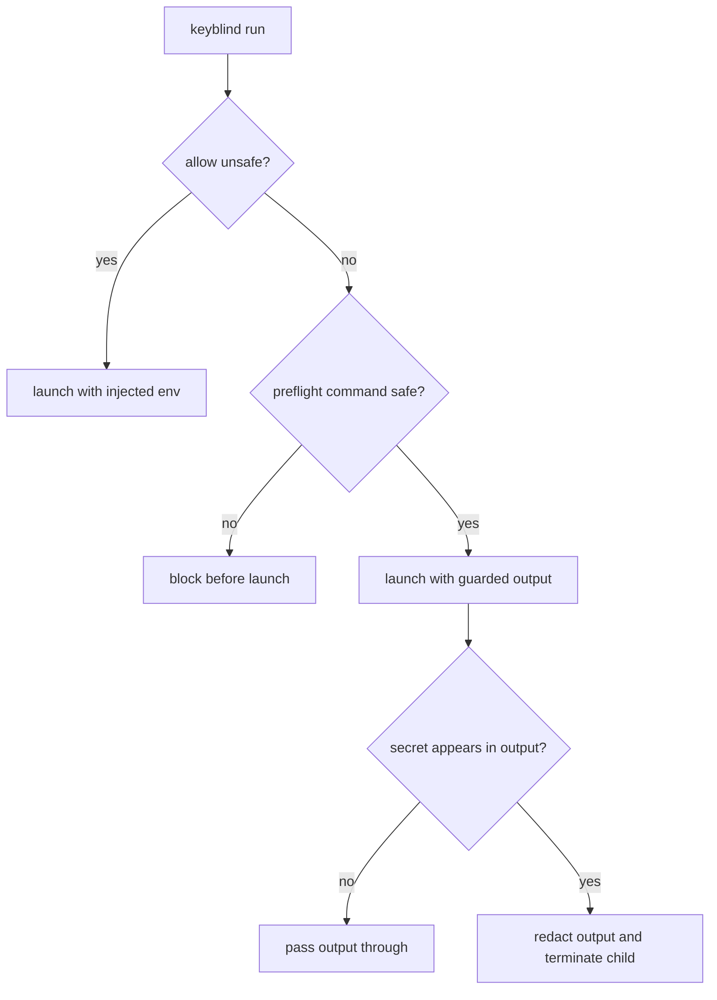
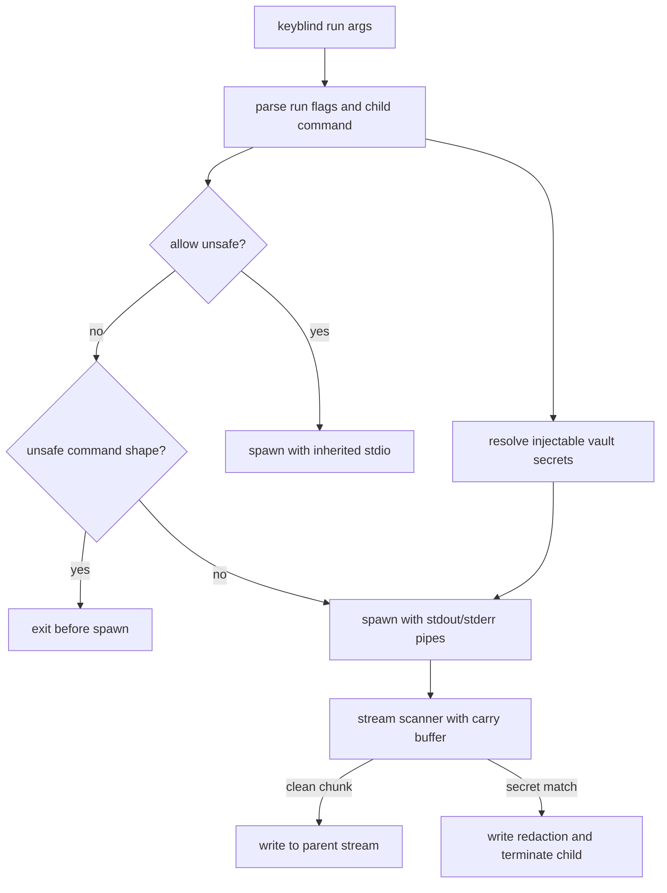

# Keyblind Run Exfiltration Guard - Plan

## Goal Capsule

- **Objective:** Make `keyblind run` guard against accidental secret exfiltration when it injects real secrets into a child process.
- **Product authority:** Keyblind's core identity is a local encrypted vault with MCP and safe `.env` sandbox/restore for AI-agent workflows.
- **Open blockers:** None; implementation should follow the guarded-run design and preserve the confirmed Product Contract.

---

## Product Contract

### Summary

`keyblind run` should become the guarded default for runtime secret injection.
It should block obvious secret-dump commands before launch, monitor child output for injected secret values, redact detected leaks, terminate the child immediately, and exit nonzero.

### Problem Frame

Keyblind already reduces transcript exposure by replacing `.env` values with deterministic fakes and injecting real secrets only at runtime.
That runtime path creates a second leak surface: a command run with injected secrets can print its environment or log a secret value back to the terminal, where an agent may capture it.
The current protection story covers sandboxing and documentation warnings, but the injected-command path needs its own fail-closed guard.

### Key Decisions

- **Guard `keyblind run` itself.** The safe behavior belongs on the normal runtime injection path so agents and humans do not need to remember a separate wrapper command.
- **Pair preflight blocking with live output detection.** Blocking obvious dump commands catches the common mistakes before launch, while output detection catches leaks from commands that look safe at invocation time.
- **Terminate on detected output leaks.** Secret output is treated as an active safety failure: redact the detected value, stop the child process, and return a nonzero result.
- **Use one broad operator override.** `--allow-unsafe` bypasses both preflight and output-leak guards, making override usage a deliberate operator responsibility.

### Actors

- A1. Local developer running commands that need real secrets.
- A2. AI coding agent invoking Keyblind workflows on the developer's behalf.
- A3. Child process receiving injected secret values as runtime environment.

### Requirements

**Default runtime guard**

- R1. `keyblind run` must guard secret-injected commands by default.
- R2. The guard must apply to secrets that Keyblind injects into the child process for the current run.
- R3. The default path must preserve the runtime injection use case for normal commands that do not attempt to expose secrets.

**Preflight exfiltration check**

- R4. Before launching, `keyblind run` must reject obvious commands whose primary behavior is dumping environment variables or shell exports.
- R5. A preflight rejection must fail before any child process receives injected secrets.
- R6. A preflight rejection must explain that the command can leak injected secrets and must point to the unsafe override.

**Output leak detection**

- R7. While the child process runs, `keyblind run` must inspect stdout and stderr for injected secret values.
- R8. If an injected secret value appears in child output, `keyblind run` must redact the value before it reaches the terminal.
- R9. After detecting an output leak, `keyblind run` must terminate the child process and exit nonzero.
- R10. Output detection must not report sandbox fake values as leaks unless those fake values were injected as real secrets for that run.

**Operator override**

- R11. `--allow-unsafe` must bypass both preflight rejection and output-leak termination.
- R12. Override usage must be visible enough that a human or agent can tell the run intentionally disabled exfiltration protection.

### Key Flows

- F1. Guarded safe command
  - **Trigger:** A1 or A2 runs a normal command through `keyblind run`.
  - **Actors:** A1 or A2, A3.
  - **Steps:** Keyblind gathers injected secrets, passes preflight, monitors child output, and lets non-leaking output through.
  - **Outcome:** The command behaves as a normal injected run and exits with the child process result.
  - **Covers:** R1, R2, R3, R7.

- F2. Blocked dump command
  - **Trigger:** A1 or A2 runs an obvious environment-dump command through `keyblind run`.
  - **Actors:** A1 or A2.
  - **Steps:** Keyblind identifies the command as unsafe before launch and exits without spawning the child.
  - **Outcome:** No injected secret reaches the unsafe child process.
  - **Covers:** R4, R5, R6.

- F3. Output leak termination
  - **Trigger:** A3 prints an injected secret value after a command passed preflight.
  - **Actors:** A1 or A2, A3.
  - **Steps:** Keyblind detects the value in output, emits redacted output, terminates A3, and exits nonzero.
  - **Outcome:** The terminal and agent transcript receive a redaction instead of the secret.
  - **Covers:** R7, R8, R9.

- F4. Unsafe override
  - **Trigger:** A1 or A2 runs `keyblind run --allow-unsafe` for a command that would otherwise be blocked or terminated.
  - **Actors:** A1 or A2, A3.
  - **Steps:** Keyblind records the operator intent in output and runs without the exfiltration guard.
  - **Outcome:** Responsibility for secret exposure shifts to the operator for that run.
  - **Covers:** R11, R12.

### Acceptance Examples

- AE1. **Covers R4, R5, R6.** Given a vault with at least one stored secret, when the user runs an obvious environment-dump command through `keyblind run`, then Keyblind exits before spawning the child and reports the unsafe-command reason.
- AE2. **Covers R7, R8, R9.** Given a child command that prints one injected secret value after launch, when the user runs it through guarded `keyblind run`, then the terminal receives a redacted value, the child is terminated, and `keyblind run` exits nonzero.
- AE3. **Covers R10.** Given a sandboxed `.env` file containing deterministic fake values, when a guarded child command prints those fake values but not injected real secrets, then output leak detection does not treat the fakes as secret leaks solely because they look like Keyblind sandbox values.
- AE4. **Covers R11, R12.** Given a command that would fail preflight or output detection, when the user runs it with `--allow-unsafe`, then Keyblind runs it without the exfiltration guard and makes the disabled protection visible.

### Scope Boundaries

- Network destination policy is out of scope for this version.
- MCP `resolve_secret` plaintext response behavior is out of scope; this plan complements the existing secret-value handling decision instead of resolving it.
- Generic shell sandboxing, syscall tracing, and full data-loss-prevention policy are out of scope.
- `.env` sandbox and doctor behavior should remain separate safety surfaces, not become prerequisites for guarded `run`.

### Dependencies / Assumptions

- The guard depends on knowing which values were injected for the current `keyblind run`.
- The first version assumes accidental exfiltration is the target; a malicious command can still transform, encode, split, or transmit secrets in ways simple output matching will not catch.
- The unsafe override is treated as an explicit operator decision to disable protection for that invocation.

### Sources / Research

- `src/cli.ts`: current `keyblind run` resolves stored secrets, injects them into child environment, and uses inherited stdio.
- `src/sandbox.ts`: current `.env` sandboxing backs up real values and writes deterministic fake values.
- `src/doctor.ts`: current `.env` safety audit warns about secret-looking unsandboxed values.
- `src/server.ts`: `vault_status` currently advertises plaintext MCP response handling.
- `docs/security.md`: current threat model treats transcript leakage as high risk and documents deterministic sandbox fakes.
- `docs/plans/2026-07-08-core-simplification-plan.md`: existing G4 tracks broader secret-value handling as an open decision.
- [OWASP Secrets Management Cheat Sheet](https://cheatsheetseries.owasp.org/cheatsheets/Secrets_Management_Cheat_Sheet.html): external security grounding for limiting human interaction with secrets, auditing, and detection-oriented lifecycle thinking.

---

## Planning Contract

### Product Contract Preservation

Product Contract unchanged.

### Key Technical Decisions

- KTD1. **Move guarded run behavior behind a small runtime helper.** `src/cli.ts` should stay a thin command adapter while the exfiltration policy, injected-secret collection, preflight check, child-process wiring, and output scanning live behind a focused interface.
- KTD2. **Pipe child stdout and stderr in guarded mode.** Guarded runs cannot use inherited output streams because Keyblind must inspect and redact output before it reaches the terminal.
- KTD3. **Treat exact injected values as the detection authority.** The first version should match the real values injected into the child process, not broad secret-looking patterns, so sandbox fakes and unrelated output do not become false positives.
- KTD4. **Handle chunk boundaries in the scanner.** Streaming output may split a secret across chunks, so the redaction layer needs a small carry buffer instead of scanning each chunk independently.
- KTD5. **Keep `--allow-unsafe` on the CLI command path.** The flag should be parsed by `keyblind run`, remove itself from child arguments, and switch the run to the existing raw behavior with an operator-visible warning.

### High-Level Technical Design

The helper should return an exit outcome that the CLI can translate into `process.exit`.
The scanner owns redaction and leak detection; the CLI owns user-facing process termination.

### Assumptions

- Empty string secrets cannot be meaningfully output-detected and should not be part of the leak matcher.
- Secrets containing null bytes remain excluded from injection, preserving the current `keyblind run` behavior.
- The first version targets accidental plaintext output, not transformed, encoded, split-by-logic, or network-transmitted exfiltration.
- Existing docs do not need to be rewritten in this PR unless the implementation changes a documented command contract beyond adding `--allow-unsafe`.

### Sequencing

Implement the pure policy and scanning surface first, then wire the CLI to it, then update docs/help text.
This keeps the highest-risk security behavior testable without relying only on spawned CLI processes.

### System-Wide Impact

- CLI behavior changes from raw inherited stdio to mediated output streams for guarded `keyblind run`.
- Secret values resolved for runtime injection become part of an in-memory matcher for the duration of the child process.
- Agent-visible terminal output gains redaction behavior and nonzero failure on detected leaks.

### Risks & Dependencies

| Risk | Mitigation |
| --- | --- |
| Chunked output can leak a split secret if scanning is per-chunk only. | Add tests where a secret spans output chunks and keep enough trailing data between scans. |
| Guarded piping can subtly change interactive command behavior. | Keep stdin inherited, document that stdout/stderr are mediated, and preserve raw inherited stdio under `--allow-unsafe`. |
| Overbroad matching can redact benign values. | Match only non-empty injected values for the current run. |
| Termination can leave child subprocess trees alive. | Use Node process APIs conservatively and test that the direct child is signaled; deeper process-group handling can remain a follow-up if needed. |

### Deferred to Follow-Up Work

- Network destination policy for commands that transmit secrets without printing them.
- Detection of encoded, transformed, partial, or intentionally obfuscated secrets.
- Process-group termination hardening for commands that spawn long-lived descendants.
- MCP or agent-facing safe-run metadata beyond the CLI behavior.

---

## Implementation Units

### U1. Extract guarded run policy and secret collection

- **Goal:** Create a focused runtime helper that prepares `keyblind run` inputs and classifies unsafe command shapes before any child process starts.
- **Requirements:** R1, R2, R4, R5, R6, R10, R11, R12; F2, F4; AE1, AE3, AE4.
- **Dependencies:** None.
- **Files:** `src/run.ts`, `src/cli.ts`, `tests/run.test.ts`.
- **Approach:** Add a small `src/run.ts` module for run-argument parsing, unsafe-command preflight, injectable secret filtering, and override state.
  Keep command-shape blocking close to the existing wrapper precedent: direct environment-dump commands and simple shell `-c` forms that invoke environment dumping.
  Preserve current null-byte filtering and exclude empty values from leak matching.
- **Patterns to follow:** `src/sandbox.ts` for keeping domain-specific policy in a focused module; `src/cli.ts` for adapter-style command parsing.
- **Test scenarios:**
  - Covers AE1. Given command arguments for `env`, `printenv`, `/usr/bin/env`, or shell `-c` with an environment dump, preflight returns a blocked outcome before spawn.
  - Covers AE4. Given the same command arguments with `--allow-unsafe`, parsing removes the flag from child args and preflight does not block.
  - Covers AE3. Given sandbox-looking fake values that are not injected secret values, the collected matcher set does not treat them as leaks.
  - Given stored secrets with null bytes or empty values, collection preserves current injection behavior where applicable and does not add impossible leak matchers for empty values.
- **Verification:** Policy tests prove blocked and override paths without spawning child processes.

### U2. Add guarded child process output redaction and termination

- **Goal:** Run child processes through a guarded output layer that redacts injected secret values and stops leaking commands.
- **Requirements:** R1, R2, R3, R7, R8, R9, R10; F1, F3; AE2, AE3.
- **Dependencies:** U1.
- **Files:** `src/run.ts`, `tests/run.test.ts`.
- **Approach:** Add a guarded execution path that spawns the child with stdin inherited and stdout/stderr piped.
  Write clean output through to the corresponding parent stream.
  When the scanner finds an injected value, emit a redacted substitute, signal the child, and resolve a nonzero leak-detected outcome.
  Keep a carry buffer so values split across chunks are detected before bytes are released.
- **Execution note:** Implement this test-first because the leak behavior is security-sensitive and easy to regress.
- **Patterns to follow:** Existing CLI use of Node `spawn`; Vitest module tests for deterministic security behavior.
- **Test scenarios:**
  - Covers AE2. Given a child that prints an injected secret on stdout, guarded execution writes a redaction, terminates the child, and returns nonzero.
  - Covers AE2. Given a child that prints an injected secret on stderr, guarded execution redacts stderr and returns nonzero.
  - Covers AE2. Given a secret split across multiple output chunks, guarded execution does not release the plaintext and returns nonzero.
  - Covers AE3. Given output containing a sandbox fake but no injected real secret, guarded execution passes the fake through and returns the child exit code.
  - Given a clean child command, guarded execution preserves stdout, stderr, and the child exit code.
- **Verification:** Unit tests demonstrate redaction before terminal write, leak-triggered termination, chunk-boundary detection, and clean-output pass-through.

### U3. Wire guarded execution into `keyblind run`

- **Goal:** Make the CLI `run` command use guarded execution by default while preserving the explicit unsafe escape hatch.
- **Requirements:** R1, R3, R5, R6, R9, R11, R12; F1, F2, F3, F4; AE1, AE2, AE4.
- **Dependencies:** U1, U2.
- **Files:** `src/cli.ts`, `tests/run.test.ts`.
- **Approach:** Replace the current inline `run` branch with calls into the runtime helper.
  Preserve the current initialization check and command-argument shape, but support `--allow-unsafe` inside the `run` command.
  Make blocked, leak-detected, child-exit, and spawn-error outcomes map to clear CLI exit behavior.
- **Patterns to follow:** Existing `src/cli.ts` branches that delegate to focused modules such as sandboxing, doctor, and setup.
- **Test scenarios:**
  - Covers AE1. Invoking the CLI run path with a blocked command exits nonzero and does not spawn the child.
  - Covers AE2. Invoking the CLI run path with a command that prints an injected secret exits nonzero and does not print plaintext.
  - Covers AE4. Invoking the CLI run path with `--allow-unsafe` allows a command that would otherwise be blocked and makes disabled protection visible.
  - Given a safe command, the CLI run path injects the secret and exits with the child code.
- **Verification:** CLI-facing tests cover the command branch rather than only pure helper functions.

### U4. Update command help and security documentation

- **Goal:** Document the guarded default and the operator meaning of `--allow-unsafe`.
- **Requirements:** R6, R11, R12.
- **Dependencies:** U3.
- **Files:** `src/cli.ts`, `README.md`, `docs/commands.md`, `docs/security.md`.
- **Approach:** Update help text and user docs so `keyblind run` is described as guarded runtime injection.
  Keep the wording precise: the guard prevents obvious and accidental plaintext output leaks, not all exfiltration.
- **Patterns to follow:** Existing CLI reference sections in `README.md` and `docs/commands.md`; existing threat-model wording in `docs/security.md`.
- **Test scenarios:**
  - Test expectation: none -- documentation-only updates beyond any help snapshot or CLI-help assertions introduced in U3.
- **Verification:** Docs describe `--allow-unsafe`, fail-closed leak behavior, and the non-goals around network or transformed exfiltration.

---

## Verification Contract

| Gate | Proves | Applies to |
| --- | --- | --- |
| `npm run build` | TypeScript compiles after CLI/run helper changes. | U1, U2, U3, U4 |
| `npm test -- tests/run.test.ts` | Targeted run-guard behavior passes. | U1, U2, U3 |
| `npm test` | Existing vault, sandbox, server, and integration behavior remains intact. | All units |

Security verification must include a transcript-oriented assertion: no test that triggers a leak may observe the raw injected secret in captured stdout or stderr.

---

## Definition of Done

- Product Contract remains unchanged and all R/F/AE behavior is either implemented or explicitly deferred by the plan.
- `keyblind run` blocks obvious dump commands before injecting secrets unless `--allow-unsafe` is set.
- Guarded child output never emits an injected plaintext secret in the tested stdout, stderr, and split-chunk cases.
- Leak detection terminates the direct child process and exits nonzero.
- `--allow-unsafe` bypasses both preflight and output leak detection and visibly communicates disabled protection.
- Documentation names the protection boundary and the unsafe override clearly.
- `npm run build`, targeted run-guard tests, and the full test suite pass.
