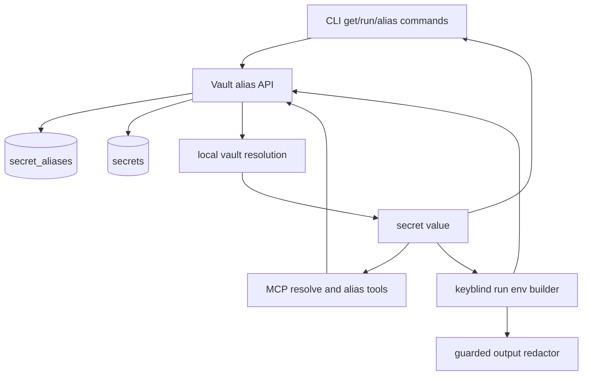

# Secret Aliases Across CLI and MCP - Plan

## Goal Capsule

- **Objective:** Add first-class secret aliases so one stored secret can be addressed by another name across CLI runtime injection and MCP secret resolution.
- **Product authority:** Keyblind remains a local encrypted secrets vault for AI agents; aliases are metadata pointers to existing secrets, not duplicated secret values.
- **Execution profile:** Standard feature plan touching vault metadata, CLI commands, MCP tools, guarded run injection, tests, docs, and completions.
- **Stop conditions:** Stop if implementation would require changing encrypted secret value format, weakening guarded-run redaction, or making external backends store alias metadata.
- **Tail ownership:** Implementation owns local alias persistence and current local-backend behavior; deeper external-backend alias semantics are deferred unless implementation reveals a low-risk compatible path.

---

## Product Contract

### Summary

Keyblind should let a secret stored as `HELLO` also be addressed as `WORLD`.
The durable behavior is persistent aliasing: after creating alias `WORLD -> HELLO`, CLI `get WORLD`, MCP `resolve_secret` with `WORLD`, and guarded `keyblind run` injection can all use the alias without duplicating encrypted secret material.
The transient `keyblind run --env HELLO:WORLD` form remains useful for one-off child-process environment mapping, but it is not the only alias surface.

### Problem Frame

Developers often need a local secret to satisfy a different environment variable name expected by an app, framework, deployment script, or agent workflow.
Today Keyblind injects and resolves secrets only under stored names, so users either duplicate secret values under multiple names or manually map them outside Keyblind.
Duplicating values increases rotation drift and audit confusion.
Aliases should hide that complexity behind a simple name mapping while preserving Keyblind's safety contract: no plaintext duplication, guarded output redaction remains value-based, and AI agents can resolve aliases through MCP instead of needing shell-only behavior.

### Actors

- A1. Local developer who stores and rotates the canonical secret.
- A2. AI coding agent using MCP tools to inspect and resolve secrets.
- A3. Child process launched by `keyblind run` that expects specific environment variable names.
- A4. Maintainer reviewing audit/list output and docs for secret ownership.

### Requirements

**Alias model**

- R1. Keyblind must store alias metadata as alias name plus target secret name, without copying or re-encrypting the target secret value.
- R2. Alias creation must reject malformed names, internal-reserved names, self-aliases, alias-to-alias chains, and aliases that collide with existing canonical secret names.
- R3. Alias deletion must remove only alias metadata and must not delete the target secret.
- R4. Deleting a canonical secret must not leave a dangling alias that resolves to a missing value.

**Resolution behavior**

- R5. CLI `get <alias>` must resolve the target secret value through the alias.
- R6. MCP `resolve_secret` must resolve aliases through the same alias-aware path as CLI resolution.
- R7. Alias resolution must preserve existing biometric/session gates and audit logging for canonical secret access.
- R8. Missing alias targets must fail closed with a not-found result instead of returning stale or partial metadata.

**Runtime injection**

- R9. Default `keyblind run` must be able to inject alias names as environment variables, so a persistent alias `WORLD -> HELLO` gives the child `WORLD=<HELLO value>`.
- R10. `keyblind run --env SOURCE:TARGET` must support one-off process-time mapping without creating persistent alias metadata.
- R11. Guarded-run redaction must track resolved secret values regardless of whether they were injected under canonical names, persistent aliases, or transient `--env` targets.
- R12. Duplicate target environment names in a single run must fail before spawning the child.

**MCP and discovery**

- R13. MCP must expose alias management and listing tools so agents can create, delete, and inspect aliases without shelling out.
- R14. Secret listing must keep canonical secrets and aliases distinguishable without exposing plaintext values.
- R15. Capability metadata and documentation must describe which tools return plaintext and which tools return alias metadata only.

### Key Flows

- F1. Create and resolve alias through CLI
  - **Trigger:** A1 stores `HELLO` and wants local commands to use `WORLD`.
  - **Actors:** A1
  - **Steps:** A1 creates alias `WORLD -> HELLO`, then runs `keyblind get WORLD`.
  - **Outcome:** Keyblind returns the `HELLO` value, audited as a resolved access.
  - **Covers:** R1, R2, R5, R7

- F2. Resolve alias through MCP
  - **Trigger:** A2 asks Keyblind to resolve `WORLD`.
  - **Actors:** A2
  - **Steps:** MCP `resolve_secret` translates `WORLD` to `HELLO`, resolves the target through the configured local vault path, and returns plaintext under the existing explicit plaintext contract.
  - **Outcome:** The agent can use `WORLD` as a secret name without knowing the canonical storage name.
  - **Covers:** R6, R7, R13, R15

- F3. Run command with persistent alias injection
  - **Trigger:** A1 or A2 launches a command that expects `WORLD`.
  - **Actors:** A1 or A2, A3
  - **Steps:** `keyblind run` builds the child environment from canonical names plus aliases, resolves `WORLD -> HELLO`, and starts the guarded child.
  - **Outcome:** The child sees `WORLD`, and any printed value is redacted by the existing guard.
  - **Covers:** R9, R11, R14

- F4. Run command with transient alias injection
  - **Trigger:** A1 needs a one-off mapping but does not want to persist it.
  - **Actors:** A1, A3
  - **Steps:** A1 runs `keyblind run --env HELLO:WORLD -- <command>`.
  - **Outcome:** The child receives `WORLD` for that process only; no alias metadata is stored.
  - **Covers:** R10, R11, R12

- F5. Delete target secret
  - **Trigger:** A1 deletes canonical secret `HELLO`.
  - **Actors:** A1, A4
  - **Steps:** Keyblind deletes the canonical secret and removes aliases targeting it.
  - **Outcome:** Future alias resolution fails cleanly and list output has no dangling `WORLD -> HELLO` entry.
  - **Covers:** R3, R4, R8

### Acceptance Examples

- AE1. Given stored secret `HELLO=value`, when the user creates alias `WORLD -> HELLO` and runs `keyblind get WORLD`, then the CLI prints `value` and no duplicate secret row is created.
- AE2. Given alias `WORLD -> HELLO`, when an MCP client calls `resolve_secret` with `WORLD`, then the tool returns the same plaintext value as `HELLO` and includes safe metadata showing that an alias was resolved.
- AE3. Given alias `WORLD -> HELLO`, when `keyblind run -- <command>` starts a clean child process, then the child can read `process.env.WORLD`.
- AE4. Given no persistent alias, when `keyblind run --env HELLO:WORLD -- <command>` starts a clean child process, then the child can read `process.env.WORLD` and `list_aliases` remains unchanged.
- AE5. Given two run specs that target `WORLD`, when `keyblind run` is invoked, then Keyblind fails before spawning and reports the duplicate target.
- AE6. Given alias `WORLD -> HELLO`, when `HELLO` is deleted, then `WORLD` no longer appears in alias listing and `resolve_secret("WORLD")` returns not found.

### Scope Boundaries

#### In Scope

- Local alias metadata stored in Keyblind's vault database.
- CLI alias management commands.
- MCP alias management/listing tools and alias-aware `resolve_secret`.
- Alias-aware guarded run environment preparation.
- Documentation, command help, completions, and tests for the new surface.

#### Deferred to Follow-Up Work

- Full external-backend alias validation and migration semantics across 1Password, Bitwarden, AWS, GCP, Azure, and env backends.
- Alias import/export format changes beyond documenting current local alias behavior.
- A bulk alias file format or `.env` alias-template language.
- MCP resources for rich alias graph/context beyond simple tools.

#### Outside This Product's Identity

- Storing duplicate encrypted secret values for each alias.
- Automatically rewriting `.env` files to persist alias references.
- Alias chains, wildcards, prefix matching, or glob-style alias rules.
- Any alias behavior that returns plaintext through metadata/listing tools.

---

## Planning Contract

### Product Contract Preservation

Product Contract created from direct planning after the user expanded the original run-only alias idea to include MCP coverage.

### Key Technical Decisions

- KTD1. **Store aliases in a dedicated vault metadata table.** Alias metadata should live beside the encrypted local vault because both CLI and MCP need one source of truth, but aliases must not be encrypted duplicate secret values.
- KTD2. **Resolve aliases through a small vault helper before decrypting.** A helper that turns a requested local-vault name into a canonical target keeps CLI, MCP, and run injection consistent without spreading alias lookups across call sites.
- KTD3. **Disallow alias chains.** Alias-to-alias chains add cycle detection, deletion ambiguity, and audit confusion without clear value; creation should target a canonical visible secret.
- KTD4. **Keep list surfaces explicit.** Canonical `listSecrets()` behavior should remain stable for existing callers; add alias-specific listing where metadata is needed, and let CLI/MCP display aliases deliberately.
- KTD5. **Use local alias metadata as a local-backend feature first.** Alias translation applies when Keyblind is resolving through the local vault. The first implementation should not mutate external secret managers or claim external-backend alias parity.
- KTD6. **Keep guarded-run redaction value-based.** Alias names and target names are metadata; the redactor should continue deduping exact non-empty resolved values injected for the current run.

### High-Level Technical Design



Alias resolution should have one conceptual path:

```text
requested name -> alias lookup -> canonical target name -> resolve canonical value -> audit access -> caller
```

`keyblind run --env SOURCE:TARGET` adds a process-time mapping before the child environment is built:

```text
source name -> alias-aware resolve -> child env target name -> guarded redaction set
```

### Assumptions

- Alias names use the same practical naming constraints as secret names plus stricter rejection of internal prefixes.
- For the first implementation, alias creation validates canonical target names against the local vault and alias-aware resolution applies to local-vault resolution. External backend alias validation and translation are deferred rather than guessed.
- `list_secrets` remains canonical-secret focused for backward compatibility; alias metadata is exposed through new alias-specific surfaces.
- Audit log schema can remain unchanged for the first pass by auditing the canonical target secret access under the existing schema; richer requested-alias-vs-target audit projection can be a follow-up if needed.

### System-Wide Impact

This feature changes the meaning of a secret name at the vault boundary.
Any module using `resolveSecret` may become alias-aware if the helper is integrated at that level.
That is desirable for CLI `get`, MCP `resolve_secret`, and run injection, but implementation must ensure internal prefixed records and removed-feature denylist entries remain unresolvable through aliases.

### Risks & Dependencies

| Risk | Mitigation |
|---|---|
| Alias names could expose or collide with internal records. | Reject internal prefixes and canonical-name collisions at alias creation. |
| Alias-aware resolution could accidentally make deleted internal records reachable. | Apply the existing removed/internal denylist before and after alias translation. |
| Default run injection could duplicate values under canonical and alias names. | Keep leak values deduped by plaintext value and document that aliases are additional env names. |
| External backends have different listing and validation behavior. | Keep alias creation and alias-aware translation scoped to local-vault resolution in the first pass; defer full external-backend parity. |
| MCP list output could leak too much context. | Keep alias listing metadata-only: alias name and target name, never values. |

### Sources & Research

- `src/vault.ts` - local encrypted storage, secret CRUD, audit log, internal record filtering.
- `src/server.ts` - MCP tool surface, `resolve_secret`, safe visible-name filtering, capabilities metadata.
- `src/run.ts` - guarded run argument parsing, environment construction, output redaction, child process spawning.
- `src/cli.ts` - CLI command adapter, current `get`, `list`, `delete`, `run` branches.
- `tests/vault.test.ts`, `tests/server.test.ts`, `tests/run.test.ts`, `tests/integration.test.ts` - current regression patterns for the touched surfaces.
- `docs/ideation/2026-07-09-secret-alias-run-env-ideation.html` - ideation origin and rejected alternatives.
- `docs/plans/2026-07-09-001-feat-keyblind-run-exfiltration-guard-plan.md` - guarded-run safety contract to preserve.

---

## Implementation Units

### U1. Add vault alias metadata and alias-aware resolution

- **Goal:** Add durable alias metadata and a single alias-aware resolver path in the vault layer.
- **Requirements:** R1, R2, R3, R4, R7, R8; F1, F5; AE1, AE6
- **Dependencies:** None.
- **Files:** `src/vault.ts`, `tests/vault.test.ts`
- **Approach:** Create a `secret_aliases` table keyed by alias name with target name and timestamps. Add focused helpers for create, delete, list, lookup, and alias-aware resolution. Creation should reject malformed names, internal prefixes, collisions with canonical secrets, self-aliases, alias-to-alias targets, and missing local targets. Deleting a canonical secret should remove aliases targeting it.
- **Execution note:** Implement the vault tests first because every other surface depends on this behavior.
- **Patterns to follow:** Existing `secrets` table migration style in `getDb`; existing internal record filtering in `listSecrets` and `resolveSecret`; existing audit behavior in `storeSecret`, `resolveSecret`, and `deleteSecret`.
- **Test scenarios:**
  - Covers AE1. Given `HELLO=value`, creating alias `WORLD -> HELLO` lets alias-aware resolution of `WORLD` return `value`.
  - Given alias creation for an existing canonical secret name, the helper rejects the alias and leaves existing secrets unchanged.
  - Given alias creation targeting another alias, the helper rejects it.
  - Given alias creation using an internal prefix such as `__keyblind`, `_totp`, or removed-feature names, the helper rejects it.
  - Covers AE6. Given `WORLD -> HELLO`, deleting `HELLO` removes the alias and future resolution of `WORLD` returns null.
  - Given alias deletion for `WORLD`, the target `HELLO` still resolves.
- **Verification:** Vault tests prove alias metadata does not create duplicate secret rows, invalid aliases fail closed, and target deletion cannot leave resolving aliases behind.

### U2. Add CLI alias management and alias-aware local commands

- **Goal:** Let users create, inspect, and delete aliases from the CLI, and make `get` resolve aliases.
- **Requirements:** R2, R3, R5, R14; F1, F5; AE1, AE6
- **Dependencies:** U1.
- **Files:** `src/cli.ts`, `src/completions.ts`, `tests/integration.test.ts`
- **Approach:** Add CLI commands for alias creation, alias deletion, and alias listing. Keep command output metadata-only for list operations. Update `get` to use alias-aware resolution. Keep `set` storing canonical secrets only; alias creation is a separate command so values are not duplicated.
- **Patterns to follow:** Existing `set`, `get`, `list`, and `delete` CLI branches; existing completions command arrays.
- **Test scenarios:**
  - Covers AE1. Given `HELLO=value`, the CLI alias path creates `WORLD -> HELLO` and `get WORLD` resolves `value`.
  - Given `unalias WORLD`, listing aliases no longer shows `WORLD` and `HELLO` remains resolvable.
  - Given alias listing, output includes alias and target names but never secret values.
  - Given invalid alias creation, the CLI exits nonzero and prints a safe error.
- **Verification:** Integration coverage proves CLI-facing alias behavior uses the vault helper rather than duplicating value storage.

### U3. Add MCP alias tools and alias-aware `resolve_secret`

- **Goal:** Make aliases usable and manageable by MCP clients.
- **Requirements:** R6, R7, R13, R14, R15; F2; AE2
- **Dependencies:** U1.
- **Files:** `src/server.ts`, `tests/server.test.ts`, `tests/vault.test.ts`
- **Approach:** Add MCP tools named `create_alias`, `delete_alias`, and `list_aliases`. Update `resolve_secret` to use the alias-aware resolver for local vault resolution and to return safe alias metadata such as requested name and resolved target name when an alias was used. For non-local configured backends, preserve existing direct-name resolution until external-backend alias semantics are deliberately designed. Update capabilities metadata to describe the new tools and their safety semantics.
- **Patterns to follow:** Existing MCP tool registration style in `createServer`; existing JSON response structure for `resolve_secret`, `store_secret`, `list_secrets`, and context/status tools.
- **Test scenarios:**
  - Covers AE2. Given alias `WORLD -> HELLO`, calling MCP `resolve_secret` with `WORLD` returns the `HELLO` value and safe alias metadata.
  - Given no alias for `MISSING`, MCP `resolve_secret` preserves the existing not-found shape.
  - Given MCP alias listing, response contains alias and target names only.
  - Given MCP alias creation for an invalid alias, response is an error and stores no alias.
  - Given server tool registration, the retained tool list includes alias tools and still excludes removed team/deadman/SSO surfaces.
- **Verification:** Server tests prove alias tools are registered, `resolve_secret` is alias-aware, and metadata-only tools never return plaintext.

### U4. Extend guarded run injection for persistent and transient aliases

- **Goal:** Let child processes receive persistent alias names and one-off `--env SOURCE:TARGET` mappings while preserving guarded-run safety.
- **Requirements:** R9, R10, R11, R12; F3, F4; AE3, AE4, AE5
- **Dependencies:** U1.
- **Files:** `src/run.ts`, `src/cli.ts`, `tests/run.test.ts`
- **Approach:** Extend run argument parsing to consume repeatable `--env` specs before the child command separator. Represent run inputs as source name plus target env name so persistent aliases and transient mappings share one environment-building path. When no `--env` specs are provided, include canonical secret names plus alias names as injectable environment names. When specs are provided, inject only those requested mappings. Fail before spawn on malformed specs, missing sources, null-byte names or values, and duplicate target env names.
- **Execution note:** Preserve current unsafe-command preflight ordering: blocked commands must fail before resolving or injecting secrets.
- **Patterns to follow:** Existing `parseRunArgs`, `buildRunEnvironment`, `checkUnsafeCommand`, and redaction tests in `tests/run.test.ts`; prior guarded-run plan's exact-value redaction decision.
- **Test scenarios:**
  - Covers AE3. Given alias `WORLD -> HELLO`, default run environment preparation injects `WORLD` with the target value.
  - Covers AE4. Given `--env HELLO:WORLD`, environment preparation injects `WORLD` without requiring persistent alias metadata.
  - Given `--env WORLD` where `WORLD` is a persistent alias, environment preparation resolves the alias and injects env var `WORLD`.
  - Covers AE5. Given two specs targeting `WORLD`, run parsing or environment preparation fails before spawn.
  - Given an unsafe command with aliases configured, preflight blocks before any alias source is resolved.
  - Given a child prints a value injected through an alias, guarded output redacts the value and returns the existing leak outcome.
- **Verification:** Run tests prove alias injection, transient mapping, duplicate target rejection, preflight-before-resolution, and redaction invariants.

### U5. Update documentation, help, and completion surfaces

- **Goal:** Make alias behavior discoverable and precise across user docs, security docs, CLI help, and shell completions.
- **Requirements:** R13, R14, R15
- **Dependencies:** U2, U3, U4.
- **Files:** `src/cli.ts`, `src/completions.ts`, `README.md`, `docs/commands.md`, `docs/mcp-integration.md`, `docs/security.md`
- **Approach:** Document aliases as metadata pointers, not duplicate secrets. Show both persistent alias and transient `run --env SOURCE:TARGET` examples. Update MCP tool tables and capability language so agents can discover alias management. State the safety boundary: alias list tools return names only, while alias-aware resolution still follows the existing plaintext `resolve_secret` contract.
- **Patterns to follow:** Existing CLI reference sections in `README.md` and `docs/commands.md`; existing MCP tool tables in `README.md` and `docs/mcp-integration.md`; existing threat model language in `docs/security.md`.
- **Test scenarios:**
  - Test expectation: none -- documentation and completion updates are covered by build/typecheck and surface review.
- **Verification:** Docs describe persistent aliases, transient run mapping, MCP alias tools, alias deletion behavior, duplicate target failure, and non-goals around alias chains and plaintext duplication.

---

## Verification Contract

| Gate | Proves | Applies to |
|---|---|---|
| `npm run build` | TypeScript compiles after vault, CLI, MCP, and run-helper changes. | All units |
| `npm test -- tests/vault.test.ts tests/run.test.ts tests/server.test.ts` | Targeted alias model, guarded run, and MCP behavior pass. | U1, U3, U4 |
| `npm test` | Existing vault, sandbox, backend, server, and integration behavior remains intact. | All units |

Security verification must include assertions that alias listing never exposes plaintext and that run leak detection redacts values resolved through aliases.

---

## Definition of Done

- Alias metadata exists as a local pointer from alias name to canonical secret name, with no duplicate encrypted value rows.
- CLI users can create, list, delete, and resolve aliases.
- MCP clients can create, list, delete, and resolve aliases through documented tools.
- `resolve_secret("WORLD")` can resolve `WORLD -> HELLO` and returns plaintext under the existing explicit plaintext contract.
- `keyblind run` can inject persistent aliases and one-off `--env SOURCE:TARGET` mappings.
- Guarded-run preflight, redaction, and leak outcomes remain intact for alias-injected values.
- Invalid alias definitions, missing targets, alias chains, internal names, and duplicate run targets fail closed.
- Documentation and completions describe alias behavior and non-goals.
- Targeted tests and the full test suite pass.
- Abandoned experimental code from implementation attempts is removed before completion.
