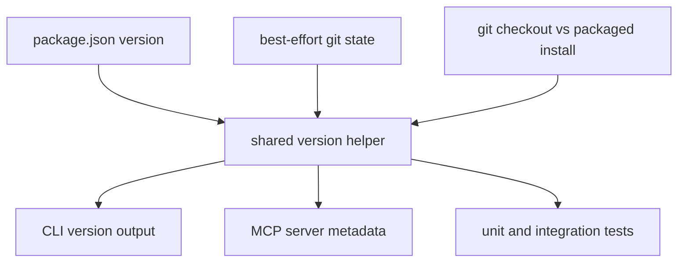

## Goal Capsule

| Field | Value |
| --- | --- |
| Objective | Make Keyblind show a useful local/dev version identity while preserving `package.json` as the publish-only semver authority. |
| Authority hierarchy | User request, npm package metadata rules, SemVer 2.0.0, existing Keyblind CLI/MCP surfaces. |
| Execution profile | Standard code change touching shared version metadata, CLI output, MCP server metadata, tests, and release docs. |
| Stop conditions | Stop if implementing local identity requires mutating `package.json` during dev or introducing release automation beyond documented npm release guidance. |
| Tail ownership | Implementation owns the shared version helper and user-visible reporting; actual release automation remains deferred. |

---

## Product Contract

### Summary

Keyblind needs two different notions of version without making developers maintain two version numbers.
The published package version remains the semver value in `package.json`; local/dev builds derive a display identity from that version plus local source state.
Users and agents should be able to tell whether they are running a published build or a local checkout without polluting package metadata.

### Problem Frame

Today `package.json` declares `0.6.0`, while the MCP server hardcodes the same value in `src/server.ts`.
There is no CLI `--version` surface, and local checkouts cannot distinguish "the published 0.6.0 package" from "a modified local build based on 0.6.0".
Changing `package.json` for each local build would create lockfile churn and weaken semver as the release contract.

### Requirements

- R1. `package.json` remains the single declared package version and changes only through intentional release/versioning flows.
- R2. Local/dev version output includes the package semver plus derived local metadata when the checkout is not a published package state.
- R3. Published/package-like output can still report the plain package semver without a dev suffix.
- R4. CLI users can ask Keyblind for its version directly without initializing a vault.
- R5. MCP server metadata uses the same version source as the CLI rather than a duplicated literal.
- R6. Git metadata failures, source tarballs, or non-git installs degrade to a valid version string rather than throwing.
- R7. The release guidance documents when to use `npm version`, `npm publish`, and prerelease tags without making prerelease publishing part of the first implementation.

### Acceptance Examples

- AE1. Given a clean local git checkout based on package version `0.6.0`, when a user runs the version command, then the output clearly identifies it as a local/dev build based on `0.6.0`.
- AE2. Given a dirty local checkout, when a user runs the version command, then the output includes dirty-state metadata.
- AE3. Given a non-git install or source archive, when version metadata is requested, then Keyblind returns a valid string based on `package.json.version` without crashing.
- AE4. Given the MCP server is created, when clients inspect server metadata, then the reported version matches the shared version helper.

### Scope Boundaries

#### In Scope

- Add one shared version helper used by CLI and MCP metadata.
- Add CLI `version`, `--version`, and `-v` handling.
- Add tests for package version loading, local metadata formatting, git failure fallback, CLI output, and MCP metadata wiring where the SDK exposes it testably.
- Document the release/versioning policy in existing project docs.

#### Deferred to Follow-Up Work

- Full release automation, changelog generation, provenance publishing, and GitHub Actions release workflows.
- Published prerelease channels beyond documenting the intended `npm version prerelease --preid <id>` plus `npm publish --tag <tag>` path.
- Synchronizing `manifest.json`, `server.json`, Homebrew formula metadata, or MCPB bundle version fields unless implementation research proves those are the same published artifact contract.

---

## Planning Contract

### Key Technical Decisions

- KTD1. **Keep declared semver and derived identity separate.** `package.json.version` is the package release identifier; local identity is computed at runtime or build time from package version and source state. This matches npm's package metadata model, where name and version identify a published package.
- KTD2. **Use SemVer-compatible local display metadata.** The preferred local display shape is `0.6.0-dev+git.<sha>` with optional `.dirty`, using prerelease/build metadata semantics rather than inventing a second version scheme.
- KTD3. **Use one shared helper, not duplicated constants.** A `src/version.ts` style module should own package-version loading, git metadata collection, fallback behavior, and formatting so CLI and MCP stay in sync.
- KTD4. **Make git metadata best-effort.** Version reporting must not make normal CLI startup depend on `git` being present, a clean working tree, or a repository checkout.
- KTD5. **Use git checkout presence as the local/published boundary.** A working git checkout reports local/dev identity; packaged or source-archive installs without git metadata fall back to plain package semver. Add an explicit override only if implementation proves package layout makes that boundary unreliable.
- KTD6. **Document release commands; do not automate release yet.** The first version should make the intended release discipline explicit without adding a release pipeline or changing publishing behavior.

### High-Level Technical Design

The helper should expose a small API that can return the declared package version and the display version.
The default boundary is intentionally simple: git checkout state produces local/dev identity; missing git metadata produces package-like plain semver.
An explicit override is a fallback only if implementation proves packaged layout or tests need it.

### Assumptions

- The package is ESM TypeScript and does not currently enable JSON module imports, so package metadata loading may be simpler through filesystem reads relative to the built module.
- The local/dev version does not need to be cryptographically reproducible; it is an operator-facing identity string.
- Dirty-state detection can be conservative: failing to detect dirty state is acceptable only when git metadata itself is unavailable and the fallback remains explicit enough for support.

### System-Wide Impact

This change touches user-visible CLI behavior and agent-visible MCP metadata.
Because Keyblind is MCP-first, CLI and MCP version reporting should be treated as one public support surface, not separate implementation details.

### Risks & Dependencies

- Git calls can slow startup or fail in package installs; keep them lazy, bounded, and failure-tolerant.
- The MCP SDK may not expose server metadata cleanly in tests; if so, test the shared helper directly and add a narrow assertion around server construction only where practical.
- Reading `package.json` from `dist` can be fragile after publication because the package `files` list currently includes `dist` and `skills`; verify whether `package.json` is still available in the packed package and avoid helper paths that only work from the source tree.
- Build metadata is ignored for SemVer precedence, so do not rely on `+git...` to order local builds.

### Sources & Research

- `package.json` currently declares version `0.6.0` and `prepublishOnly: npm run build`.
- `src/server.ts` currently hardcodes MCP server version `0.6.0`.
- `src/cli.ts` has help flags but no version command or flag.
- npm package docs state that published packages rely on package `name` and `version` as the package identifier: https://docs.npmjs.com/cli/v11/configuring-npm/package-json/
- npm version docs describe `npm version` as the command that bumps version metadata and creates a git commit/tag by default: https://docs.npmjs.com/cli/v11/commands/npm-version/
- npm publish docs describe dist-tags, including `latest` as the default publish tag: https://docs.npmjs.com/cli/v11/commands/npm-publish/
- SemVer 2.0.0 defines prerelease identifiers and build metadata after the core version: https://semver.org/

---

## Implementation Units

### U1. Shared Version Helper

- **Goal:** Create a single implementation source for declared package version, derived local display version, git metadata, and fallback formatting.
- **Requirements:** R1, R2, R3, R6
- **Dependencies:** None
- **Files:** `src/version.ts`, `tests/version.test.ts`, `tsconfig.json` if required for metadata access
- **Approach:** Read the declared package version from `package.json` without adding a second manual constant. Gather git short SHA and dirty state best-effort with bounded synchronous or asynchronous calls appropriate for CLI startup. Format local/dev output with a SemVer-compatible prerelease/build shape when git metadata is available, and fall back to plain package semver for packaged or gitless installs.
- **Execution note:** Implement this test-first because formatting and fallback behavior are the core contract and are easy to cover without touching CLI or MCP.
- **Patterns to follow:** Keep the module deep and small, similar to `src/config.ts` and `src/doctor.ts`: one public surface hiding filesystem and process details.
- **Test scenarios:**
  - Given package version `0.6.0` and git SHA `abc1234`, formatting local display returns `0.6.0-dev+git.abc1234`.
  - Given dirty git state, formatting includes a dirty marker while preserving a valid package-version prefix.
  - Given git commands fail or return empty output, the helper returns a valid fallback based on `package.json.version`.
  - Given published/plain context, the helper returns exactly the package semver with no dev metadata.
  - Given malformed or missing package metadata in a controlled test fixture, the helper fails with a clear internal error or fallback chosen during implementation, not an unhandled stack trace.
  - Given the compiled package layout, the helper can locate the declared package version from built output.
- **Verification:** Unit tests prove every formatting branch and fallback path; a packaged-layout smoke check proves the helper works outside the source tree; no other source file contains a manually duplicated package version literal for CLI/MCP reporting.

### U2. CLI Version Surface

- **Goal:** Add direct version reporting for humans and scripts.
- **Requirements:** R2, R3, R4, R6
- **Dependencies:** U1
- **Files:** `src/cli.ts`, `tests/cli-version.test.ts`
- **Approach:** Handle `version`, `--version`, and `-v` before vault initialization or project parsing can require state. Output should be stable enough for scripts while still carrying local metadata. If implementation chooses to keep command and flag outputs identical, document that in tests.
- **Execution note:** Prefer process-level or exported-main testing only if the current CLI shape supports it cleanly; otherwise use the lightest subprocess test that exercises the built CLI behavior.
- **Patterns to follow:** Existing help flag handling in `src/cli.ts` already short-circuits before command execution.
- **Test scenarios:**
  - Given no vault is initialized, running the version flag exits successfully and prints a version string.
  - Given `version`, `--version`, and `-v`, each route prints the same version string.
  - Given a project flag is present with a version flag, version reporting does not require vault access.
  - Given git metadata is unavailable in the test environment, the command still exits successfully.
  - Given the CLI is executed from built output rather than TypeScript source, version reporting still finds package metadata.
- **Verification:** CLI version output works without a vault, without reading or writing secrets, and from the same built artifact shape users install.

### U3. MCP Server Metadata Wiring

- **Goal:** Replace hardcoded MCP server version metadata with the shared helper.
- **Requirements:** R3, R5, R6
- **Dependencies:** U1
- **Files:** `src/server.ts`, `tests/server.test.ts`, `tests/version.test.ts`
- **Approach:** Use the shared helper when creating `McpServer`. Decide whether MCP metadata should report plain package semver or local/dev display metadata; default to the same display identity as the CLI unless SDK or client expectations require strict package semver. Capture the decision in a test.
- **Patterns to follow:** `createServer()` centralizes server construction, so version wiring should stay there and not leak into individual tool definitions.
- **Test scenarios:**
  - Covers AE4. Given server construction, the configured server version matches the shared helper output or the plain helper output selected by the implementation decision.
  - Given git metadata lookup fails, server creation still succeeds.
  - Given package version changes in test fixture/mocking, MCP metadata follows the helper rather than a hardcoded literal.
- **Verification:** `src/server.ts` no longer contains the package version literal; server tests continue to cover retained tool registration.

### U4. Release Policy Documentation

- **Goal:** Document the versioning rule so future releases do not reintroduce package-version churn during development.
- **Requirements:** R1, R7
- **Dependencies:** U1, U2, U3
- **Files:** `README.md`, `docs/commands.md` or `docs/getting-started.md`, optionally `docs/solutions/tooling-decisions/local-dev-versioning-policy-2026-07-09.md`
- **Approach:** Add a short policy: local builds derive identity, `package.json.version` changes only via release intent, `npm version patch|minor|major` is the release bump path, and prereleases use npm prerelease versions plus non-latest dist-tags when deliberately published. Keep docs practical and avoid a full release-process manual.
- **Patterns to follow:** Existing docs use concise command examples and focused workflow notes.
- **Test scenarios:** Test expectation: none -- documentation-only unit; verification is review plus command examples matching implemented behavior.
- **Verification:** Docs explain both normal local/dev version output and publish-time semver behavior without instructing developers to edit package version manually for local work.

### U5. Release Guardrail Checks

- **Goal:** Add lightweight validation so version literals and package metadata drift are caught before publish.
- **Requirements:** R1, R5, R7
- **Dependencies:** U1, U3, U4
- **Files:** `package.json`, `tests/version.test.ts`, optionally `scripts/validate-release-version.*` if implementation needs a script
- **Approach:** Prefer tests over a new script if they can catch the important drift: no hardcoded MCP version, helper reads package metadata, and docs mention the release path. If a script is warranted, keep it narrow and wire it into `prepublishOnly` after `npm run build` without changing publish semantics.
- **Patterns to follow:** Current `prepublishOnly` is intentionally small and runs the TypeScript build.
- **Test scenarios:**
  - Given source search or exported helper checks, there is no hardcoded duplicate server version.
  - Given package version is the declared authority, package-lock root version remains aligned after intentional npm version bumps.
  - Given release validation runs, it does not require a vault, network, or npm authentication.
- **Verification:** `npm test` and `npm run build` cover the version helper and user-visible surfaces; publish preparation remains local and deterministic.

---

## Verification Contract

| Gate | Applies to | Done signal |
| --- | --- | --- |
| TypeScript build | U1-U5 | `npm run build` completes without type errors. |
| Test suite | U1-U5 | `npm test` passes, including new version helper and CLI/MCP tests. |
| CLI smoke | U2 | Built CLI prints a version for `version`, `--version`, and `-v` without vault initialization. |
| MCP metadata check | U3 | Server construction uses the shared helper and no hardcoded package version remains in MCP metadata. |
| Package-layout smoke | U1-U2 | A packed or built-artifact check shows the version helper can read package metadata from the same file layout users install. |
| Publish dry-run check | U4-U5 | `npm pack --dry-run` or equivalent local packaging check confirms release metadata is present and no dev mutation is needed. |

---

## Definition of Done

- `package.json.version` remains the only declared publish semver for the npm package.
- Local/dev version output includes derived metadata and never writes to `package.json` or `package-lock.json`.
- CLI version output works before vault initialization.
- MCP server metadata and CLI output share the same version helper or an explicitly tested helper mode.
- Git metadata lookup failures do not break CLI or MCP startup.
- Documentation explains local/dev identity, release-time semver bumping, and prerelease publishing guidance.
- New tests cover clean local, dirty local, git-unavailable, CLI flag/command, and MCP metadata behavior.
- Abandoned implementation experiments or temporary scripts are removed before landing.
