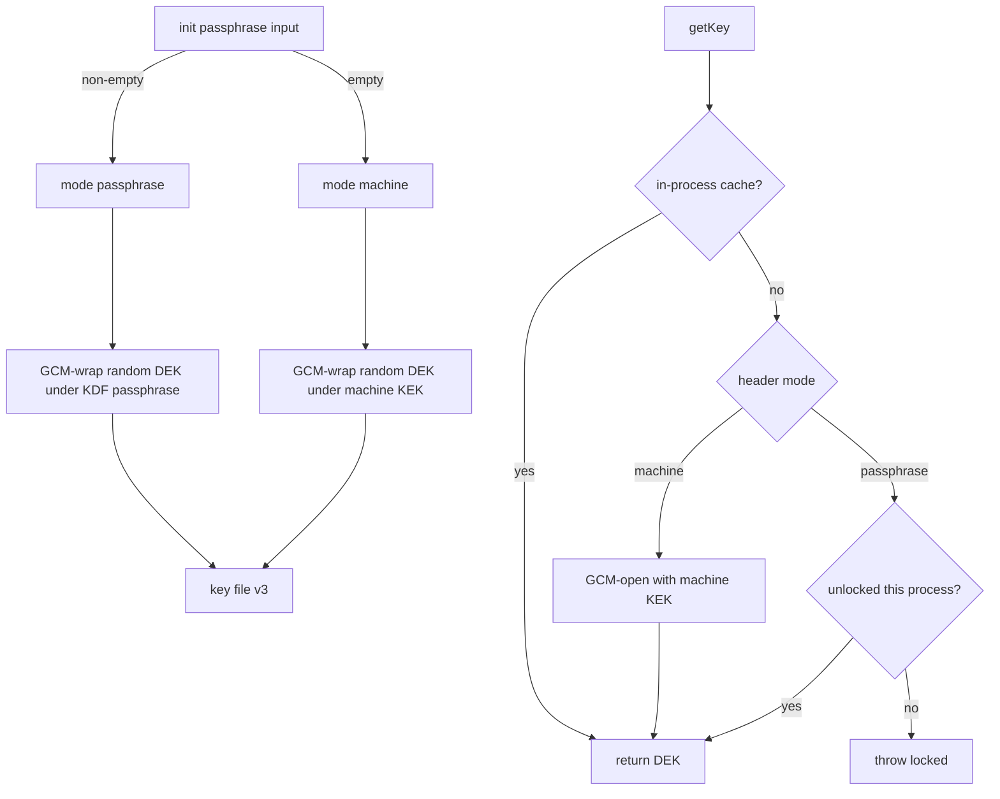

# fix: Passphrase wraps the vault master key

## Summary

Store a random vault data key wrapped with AES-256-GCM under a passphrase KDF, so a stolen key file cannot be opened without that passphrase. The app speaks only the new format. An ad hoc script migrates this machine's existing XOR key file. Machine-only remains a separate, weaker mode for agents and CI.

---

## Problem Frame

Today the vault key is `PBKDF2(passphrase)` written XOR-wrapped with a public machine fingerprint. `getKey()` unwraps with the machine identity only. The passphrase is an operator-auth check, not an at-rest lock. A same-user process or a stolen home directory plus this machine's identity recovers every secret without the passphrase. Docs claim the opposite.

---

## Requirements

- R1. After `init` with a non-empty passphrase, unwrapping the on-disk key file is impossible without that passphrase.
- R2. The vault data key is random and independent of the passphrase. Changing the wrap secret rewraps 32 bytes; it does not re-encrypt `vault.db`.
- R3. The wrap is authenticated. A wrong passphrase or a tampered key file fails closed (tag mismatch), not by walking secret rows.
- R4. Machine-only (empty passphrase at `init`) remains an explicit weaker mode. It unwraps without a user secret on the same machine and cannot be used as a back door into a passphrase vault.
- R5. The running app refuses the current XOR key-file format on every command that opens the vault, including name-only ones. No dual-read, no in-CLI upgrade.
- R6. An ad hoc script in `scripts/` migrates this machine's existing vault by unwrapping the XOR file locally and writing the new wrap around the same data key.
- R7. `keyclasp run --env` grows no biometric/operator gate. On a TTY it may ask for the wrap passphrase (SSH-without-agent). Without a TTY a locked passphrase vault fails rather than hanging an agent.
- R8. Operator gates stay: `get` and whole-scope `run` require Touch ID when available; cancelled Touch ID does not fall back; machine-only cannot authorize those paths when Touch ID is unavailable.
- R9. `list`, `delete`, `rename`, `projects`, `environments`, and `use` keep working on a locked passphrase vault (names only).
- R10. Docs describe the real model: passphrase vaults are portable with the passphrase; machine-only is not; agents and CI use machine-only.

---

## Scope Boundaries

- No long-lived `keyclasp-agent`, session unlock file, or OS keychain.
- No `KEYCLASP_PASSPHRASE` (or similar) environment variable.
- No dual-read of XOR / Keyblind key files in the app.
- No Argon2 / scrypt / engine-floor bump in this plan.
- No ciphertext AAD binding of `(project, environment, name)` on secret rows.
- No chmod hardening of `vault.db` / WAL beyond what already exists.
- No change to `run` denylist, leak redaction, or public `resolveSecret` being ungated once the process is unlocked.
- No published npm user command for migrate.

### Deferred to Follow-Up Work

- Memory-hard KDF (Argon2id once `engines` can require Node 24.7+, or scrypt).
- Confirm-on-use / Touch ID on every decrypt, and an in-memory agent.
- OS keychain wrap for machine-only (so machine mode is not just a public fingerprint).
- Binding secret-row GCM AAD to name and scope.
- Owner-only mode on `vault.db` and WAL on every open.

---

## Context & Research

### Relevant Code and Patterns

- `src/vault.ts` — `initializeVault`, `writeKeyFile` (tmp + `.N.bak` + rename + `0600`), `getKey`, `parseKeyFile` / `loadKeyFile` (XOR dual-read), `verifyVaultPassphrase`, `vaultHasPassphrase`, in-process `_key` cache.
- `src/cli.ts` — `init` passphrase via TTY or stdin; `set` may consume stdin as the secret value; `status` treats decrypt failure as exit 1.
- `src/biometric.ts` — Touch ID first; denied does not fall back; unavailable falls back to TTY passphrase; machine-only cannot authorize when Touch ID is missing.
- `src/run.ts` — whole-scope `run` calls operator auth; `--env` does not.
- `tests/key-invariant.test.ts` — encodes XOR v2 / Keyblind / headerless reads and `restartRuntime` + `resolveSecret` with no passphrase.
- `scripts/install-codex-skill.sh` — only existing script; `set -euo pipefail`, fail closed. Migrate is a new Node script, not a bash copy of this pattern.

### Institutional Learnings

- `docs/solutions/` has no wrap-format learning. The run-guard note still applies: `--allow-unsafe` must not become an unlock bypass; `run --env` stays non-interactive.

### External References

- NIST SP 800-132 Option 2 — random data key, authenticated wrap under a password-derived key.
- OWASP Password Storage / Cryptographic Storage — PBKDF2-SHA256 600k is the current floor; GCM envelope; do not persist the KDF output as the data key.
- Node.js 24 `crypto` — keep `pbkdf2Sync` + `createCipheriv("aes-256-gcm", …, { authTagLength: 16 })`. Set `authTagLength` on decrypt (DEP0182). `argon2Sync` exists only from 24.7.0; no first-class AES-KW on `node:crypto`.
- Age / Bitwarden — random file/user key wrapped by a passphrase KDF; passphrase change rewraps the key, not the data.

---

## Key Technical Decisions

- **Random data key, passphrase is only the wrap key.** Matches NIST Option 2 and makes passphrase change a key-file rewrite. Rejected: keep `dataKey = PBKDF2(passphrase)` (passphrase change would rewrite every row).
- **Two explicit modes in the header and in GCM AAD: `passphrase` and `machine`.** Parse mode first and branch. Never probe empty passphrase, then real passphrase, then machine unwrap. Empty `init` input selects `machine`; non-empty selects `passphrase`.
- **Passphrase mode wrap: AES-256-GCM under PBKDF2-SHA256 (600k, 32-byte salt, 32-byte key).** Keep the KDF the project already documents. Rejected for this plan: Argon2id (requires `engines: >=24.7.0`) and scrypt (new parameters, no local pattern).
- **Machine mode wrap: AES-256-GCM under a KEK derived from the existing stable machine identity (plus salt and magic).** Authenticated, still weak — the identity is locally public. Label it. Do not mix machine identity into the passphrase KEK (that would break portability).
- **AAD binds magic, mode, KDF id, KDF params, and salt.** Stops mode flip and KDF-parameter downgrade. Wrong passphrase is a tag failure.
- **New magic only.** App reads the new format and refuses everything else with an error that points at the ad hoc script. XOR / Keyblind / headerless paths leave `vault.ts`.
- **Unlock is in-process only.** `getKey()` auto-unwraps `machine` mode. `passphrase` mode requires an unlock in this process, then the existing `_key` cache. No daemon, no wrap secret on disk, no env var.
- **CLI: TTY wrap prompt on decrypting commands; non-TTY fail closed.** Applies to `set`, `get`, `run`, and `status`'s value check when mode is `passphrase` and the process is locked. Piped `echo value | keyclasp set NAME` does not steal stdin for the passphrase — it fails locked. Interactive `set NAME -` prompts unlock first, then the value. `run --env` does not grow a biometric gate; on a TTY it may ask for the wrap passphrase (same as `ssh` without an agent); without a TTY it errors locked.
- **Operator gate vs unwrap.** Touch ID still authorizes `get` / whole-scope `run` when available. After a successful Touch ID, passphrase mode still needs one wrap prompt if locked. On platforms without Touch ID, a single TTY passphrase both authorizes and unwraps — do not prompt twice. Cancelled Touch ID still does not fall back.
- **Product split.** Passphrase mode is an operator at-rest vault. Machine mode is the agent and CI vault. There is no “unlock once, later agent processes work.”
- **Migrate script rewraps the existing data key.** It contains its own copy of the old XOR + machine-identity unwrap (the app will no longer). It prompts for the new wrap secret (empty → machine mode). It does not rewrite `vault.db`. It is not a `keyclasp` command. Recovery after a published-package upgrade is “clone this repo and run the script,” not “the installed CLI ships migrate.”
- **Old-format vaults are inert, not half-usable.** `isInitialized()` staying true must not let `list` / `delete` / `rename` mutate ciphertext the new binary cannot unwrap. Those commands fail with the same refuse-old-format error as decrypting ones.
- **XOR leftovers after migrate are residual risk.** Successful rewrap copies the live key to `.N.bak` first. The operator must treat that backup as the old wrap until they shred it. The plan does not auto-delete `.bak`.

---

## Open Questions

### Resolved During Planning

- Is unlock-needs-passphrase true today? No. That is the bug.
- Dual-read old files in the app? No. User: no retrocompat except the ad hoc script.
- Long-lived agent / confirm-on-use / Keychain? Out of this plan.
- Keep machine-only? Yes, as a labeled weaker mode.
- Env var for the passphrase? No. New same-user leak surface.
- Upgrade KDF now? No. Stay on PBKDF2 600k.
- How do agents unlock a passphrase vault? They do not. Use machine mode.
- How does CI work? Machine-only `init` **inside** the job’s machine identity. Do not mount a laptop passphrase vault into CI or a container and expect `run --env` to work.
- Does a published npm/Homebrew install include migrate? No. Keep it out of `package.json` `files`. Docs say clone the repo (or keep an old binary) to migrate, then use the new CLI.
- Double prompt on `get`? Touch ID (if any) then one wrap prompt if still locked. No Touch ID: one passphrase.
- `status` when locked? Report mode + locked, names only, exit 0. Exit 1 only after an unwrap/decrypt actually fails.
- Migrate to machine mode silently? No. Script asks for the new wrap secret so this machine can become a real passphrase vault.

### Deferred to Implementation

- Exact on-disk field layout and helper names inside the new magic.
- Whether the migrate script is `.mjs` or `.ts` run via the repo's TypeScript toolchain.
- How loudly `init` should warn that empty input is a weaker machine-only vault.

---

## High-Level Technical Design

> *This illustrates the intended approach and is directional guidance for review, not implementation specification. The implementing agent should treat it as context, not code to reproduce.*

Mode decision for later processes:

| Mode | New CLI process, no TTY | New CLI process, TTY | Agent `run --env` |
|---|---|---|---|
| machine | unwrap, continue | unwrap, continue | unwrap, continue |
| passphrase | locked error | one wrap prompt, then continue | locked error |

`list` / `delete` / `rename` / `projects` / `environments` / `use` ignore this table (no DEK).

---

## Implementation Units

### U1. New key-file wrap in the vault

**Goal:** `init` writes only the new authenticated wrap. The app refuses XOR / Keyblind / headerless files. Mode is explicit. `vaultHasPassphrase` reads the header.

**Requirements:** R1, R2, R3, R4, R5

**Dependencies:** None

**Files:**
- Modify: `src/vault.ts`
- Test: `tests/vault.test.ts`, `tests/key-invariant.test.ts`

**Approach:**
- Generate a random 32-byte data key at `init`.
- Write magic + mode + KDF params + salt + IV + tag + wrapped data key. Reuse tmp / backup / `0600` from `writeKeyFile`.
- Delete `loadKeyFile` dual-read and auto-upgrade. Old magic → a dedicated error that names the migrate script (clone the repo; script is not in the published tarball).
- Opening a vault whose live key path is old-format fails for name-only commands too (`list`, `delete`, `rename`, `projects`, `environments`). Do not leave a mutate-but-cannot-decrypt window.
- `vaultHasPassphrase` becomes “header mode is passphrase,” not `verifyVaultPassphrase("")`.
- In-process cache after `init` still lets same-process tests and the rest of `init` work without a second prompt.

**Execution note:** Implement wrap/unwrap test-first. Rewrite `tests/key-invariant.test.ts` away from XOR fixtures; do not keep dual-read cases as app behavior.

**Patterns to follow:**
- Existing GCM usage for secret rows (`aes-256-gcm`, 12-byte IV, 16-byte tag, `authTagLength` on both sides).
- `writeKeyFile` atomic replace.

**Test scenarios:**
- Happy path: `init` with a real passphrase writes the new magic; same-process `storeSecret` / `resolveSecret` round-trips.
- Happy path: `init` with empty passphrase writes `machine` mode; `vaultHasPassphrase` is false.
- Happy path: passphrase change helper (if exposed as rewrap) changes only the key file; existing rows still decrypt with the same data key.
- Edge case: empty vault (no rows) still authenticates wrap via GCM tag, not “zero rows means any key works.”
- Error path: old `keyclasp:v2` XOR bytes throw the refuse-old-format error on `list` as well as on `resolveSecret`.
- Error path: Keyblind / headerless files throw the same class of error.
- Error path: flipped mode bit or truncated tag fails closed.
- Error path: wrong passphrase fails closed without needing a secret row.
- Integration: `setMachineIdentityForTests` still lets machine mode unwrap; changing the test identity after write fails machine unwrap.

**Verification:**
- New vaults cannot be opened by the old XOR unwrap procedure.
- `tests/key-invariant.test.ts` no longer constructs or accepts XOR files as a supported app path.

---

### U2. Locked vs unlocked getKey and CLI prompts

**Goal:** Passphrase vaults require a wrap secret in each new process before any decrypt. Machine vaults do not. Operator gates stay. Agents and non-TTY `run --env` fail locked instead of hanging.

**Requirements:** R1, R4, R7, R8, R9

**Dependencies:** U1

**Files:**
- Modify: `src/vault.ts`, `src/cli.ts`, `src/biometric.ts`, `src/index.ts`
- Test: `tests/vault.test.ts`, `tests/biometric.test.ts`, `tests/integration.test.ts`, `tests/public-api.test.ts`

**Approach:**
- `getKey()`: return cache; else machine-mode unwrap; else throw locked. Do not prompt inside the library.
- Add an unlock entry that takes a passphrase, GCM-opens the wrap, and fills the cache. `verifyVaultPassphrase` becomes “unlock succeeds,” not “PBKDF2 equals cached data key.”
- CLI decrypting commands (`set`, `get`, `run`, `status` value check): if locked and stdin is a TTY, prompt once and unlock; if locked and not a TTY, exit with a locked error that tells operators to use a TTY or a machine-only vault.
- `set` with a piped value: do not read the wrap secret from that pipe.
- `get` / whole-scope `run`: keep Touch ID-first. If still locked after the gate, one wrap prompt on TTY. If Touch ID is unavailable, the existing passphrase prompt is the unlock (one prompt).
- `status`: if locked, print mode + locked and the name count; do not call decryptability; exit 0. After unlock or in machine mode, keep today's verify/fail behavior.
- Export unlock from the public API. Keep `initializeVault` / `resolveSecret` signatures. `getKey()` remains but is lock-aware. `verifyVaultPassphrase` becomes an unlock attempt (fills cache on success). Library callers can already decrypt today; unlocking from code is accepted and documented, not an env-var-shaped hole.
- `status` on a locked passphrase vault is not a health check that injection will work. Agent skill must not treat “status exit 0” as “`run --env` will inject.”
- Leave `src/run.ts` operator-auth placement as-is; the CLI supplies an already-unlocked `resolveSecret` or fails before spawn.

**Patterns to follow:**
- `cli.ts` `readPassphrase` / `promptSecret` for TTY wrap prompts.
- `biometric.ts` TTY-only operator fallback (do not teach agents to pipe the wrap secret).

**Test scenarios:**
- Happy path: machine mode, `clearKey`, `resolveSecret` succeeds with no passphrase.
- Happy path: passphrase mode, `clearKey`, unlock with the init passphrase, then `resolveSecret` succeeds.
- Happy path: Linux-style operator path — one passphrase both authorizes and unlocks `get`.
- Edge case: `list` / `delete` / `rename` after `clearKey` on a passphrase vault still succeed.
- Error path: passphrase mode, `clearKey`, `resolveSecret` / `storeSecret` throw locked.
- Error path: wrong unlock passphrase fails; cache stays empty.
- Error path: non-TTY CLI `run --env` on a passphrase vault exits locked and does not spawn the child.
- Error path: cancelled Touch ID still does not prompt for the wrap secret.
- Error path: machine mode still cannot authorize `get` when Touch ID is unavailable.
- Integration: `echo value | keyclasp set NAME` on a locked passphrase vault fails without treating the value as the passphrase.
- Integration: interactive `set NAME -` on TTY unlocks then stores.
- Integration: `status` on a locked passphrase vault exits 0 and does not print a decrypt failure.

**Verification:**
- A new CLI process cannot decrypt a passphrase vault without a TTY wrap prompt or a prior in-process unlock.
- Agent-shaped non-TTY `run --env` is unchanged on machine vaults and fails closed on passphrase vaults.

---

### U3. Ad hoc migrate script for this machine

**Goal:** A manually invoked script in `scripts/` turns this machine's current XOR vault into the new wrap, keeping the same data key and `vault.db`.

**Requirements:** R5, R6

**Dependencies:** U1

**Files:**
- Create: `scripts/migrate-vault-key-wrap.mjs` (name may shift; keep it under `scripts/`)
- Test: `tests/migrate-vault-key-wrap.test.ts`

**Approach:**
- Self-contained old unwrap: copy today's three on-disk shapes (`keyclasp:v2`, `keyblind:v2`, headerless) and both XOR constructions (magic-bound wrapping key vs raw legacy identity). Try every identity candidate the app tries today. Do not reintroduce that path in `src/vault.ts`.
- Copy `resolveVaultHome` / `getKeyPath` exactly: `KEYCLASP_HOME` → `KEYBLIND_HOME` → dual-home conflict throw → the one complete home (`vault.db` plus either key name) → preferred. A partial `~/.keyclasp` beside a complete `~/.keyblind` is a real layout. Dual-home conflict fails closed.
- Rewrite the live path `getKeyPath` would open. After success, XOR bytes exist only in `.bak`, not in a leftover sibling `.keyblind.key` that the next `getKeyPath` would ignore.
- Copy the live key to the next free `.N.bak` and fsync **before** replacing the live name. Do not rename the live key away first (today's `writeKeyFile` crash window leaves `vault.db` with no key). Leave tmp on failure; never delete `.bak`.
- Prompt on a TTY: print resolved home, key path, and chosen mode; confirm non-empty passphrase twice (empty → machine mode, also confirmed). Refuse if stdin is not a TTY.
- Refuse if already new format, if machine unwrap fails, if the vault has no secret row to authenticate the DEK (empty / missing `secrets` must not accept the first probe), or if another process has the DB busy.
- Verify by decrypting at least one row read-only, `fileMustExist`, no `journal_mode` change, no schema migrate, no checkpoint. Look at `vault.db` plus `-wal` / `-shm` the same way a reader would. Do not call `getDb()`.
- Rollback: restore the highest `.N.bak` over the live key name only. Do not touch `vault.db`, `-wal`, or `-shm`.
- Not wired into `keyclasp` commands, `bin`, or published `files`. Docs: clone the repo to run it.

**Patterns to follow:**
- Fail closed, explicit home, backup-then-replace.
- Machine-identity probe order in today's `deriveStableMachineIdentities`.

**Test scenarios:**
- Happy path: fixture XOR v2 + one secret → script with a passphrase → app opens with that passphrase and the secret still decrypts.
- Happy path: Keyblind-magic and headerless fixtures migrate the same way.
- Happy path: same fixture, empty wrap input after confirm → machine mode; app `getKey()` works with the matching test identity.
- Error path: already-new key file at the path `getKeyPath` would open → refuse, no rewrite.
- Error path: wrong/unavailable machine identity or a vault copied from another machine → refuse, original key file intact.
- Error path: empty vault / no secret rows → refuse (do not wrap the first probe's bytes).
- Error path: both default homes complete → refuse with the same conflict meaning as the app.
- Error path: non-TTY → refuse.
- Edge case: `.N.bak` is a copy; live key name never disappears mid-run; secret row bytes in `vault.db` (and WAL if present) are unchanged.

**Verification:**
- Running the script against a copied XOR fixture yields a vault the new app can open, and the old app-format bytes are only in the backup.

---

### U4. Docs match the new threat model

**Goal:** Stop claiming XOR-plus-machine-id is the wrap, and stop implying passphrase vaults auto-unlock after `init`.

**Requirements:** R10

**Dependencies:** U1, U2, U3

**Files:**
- Modify: `docs/security.md`, `docs/recipes.md`, `docs/faq.md`, `docs/getting-started.md`, `docs/commands.md`, `README.md`, `AGENTS.md`
- Modify if unlock errors change agent copy: `skills/keyclasp-agent/SKILL.md`

**Approach:**
- Security diagram: random data key; passphrase → KDF → GCM wrap; machine mode as a separate weaker branch.
- Attack table: stolen key file + passphrase vault without the passphrase is high-cost brute force of the KDF, not XOR unwrap. Stolen key file + machine mode + machine identity is still unwrap. Same-user processes still win after unlock or in machine mode.
- Recipes: CI `init` is machine-only. “Move a vault” is true for passphrase mode (copy directory + passphrase) and false for machine mode.
- FAQ / getting started / README: lost passphrase is unrecoverable; old XOR files need the ad hoc script; agents should use machine-only or accept locked errors on passphrase vaults.
- `AGENTS.md`: replace the “XOR-wrapped with a machine fingerprint” key decision.
- Agent skill: if the vault is locked or old-format, report the error; do not prompt; do not treat `status` exit 0 as “injection will work”; do not fall back to asking for plaintext.

**Test scenarios:**
- Test expectation: none -- documentation only. Spot-check that no remaining sentence claims `getKey()` unwraps a passphrase vault from machine identity alone.

**Verification:**
- A reader of `docs/security.md` and `docs/recipes.md` can predict U1–U3 behavior, including the agent/CI vs operator split.

---

## System-Wide Impact

- **Interaction graph:** Every path that opens the vault becomes format-aware. Decrypting paths are also lock-aware. Name-only commands refuse old-format keys (they must not mutate ciphertext the new binary cannot unwrap). Biometric helper stays a gate, not an unwrap. `status` exit 0 on a locked passphrase vault is not proof that `run --env` will inject.
- **Error propagation:** Five classes: locked, refuse-old-format, corrupt new key file, wrong passphrase, row decrypt failure. CLI maps locked and refuse-old-format to short operator messages (TTY/machine-only vs clone-and-migrate). `status` locked → exit 0; `status` old-format → non-zero.
- **State lifecycle risks:** In-process cache dies with the process. Migrate copies the live key to `.N.bak` before replace so a crash never leaves `vault.db` without a live key. After success the `.bak` is still the old XOR wrap. Mixed old/new binaries on PATH: new files look corrupt to an old CLI; rollback is restore `.bak` + old binary.
- **API surface parity:** `getKey()` becomes lock-aware. `verifyVaultPassphrase` becomes unlock (cache fill on success). `vaultHasPassphrase` reads the header. Library `unlock` is a programmatic passphrase path — accepted because the library already decrypted without a CLI. Add unlock to `src/index.ts` and assert it in `tests/public-api.test.ts`.
- **Integration coverage:** CLI process-per-invocation is the real contract. Cover non-TTY `run --env`, piped `set`, `status` locked vs old-format, and name-only commands against an XOR fixture.
- **Operational contract break:** Published CI (`init` with a passphrase, then new-process `set` / `run --env`) and “mount the laptop vault into a container” stop working for passphrase vaults. CI must machine-`init` inside that job's identity. A container does not inherit the host fingerprint.
- **Unchanged invariants:** `run --env` has no biometric gate. `--allow-unsafe` does not unlock. Cancelled Touch ID does not fall back. Projects/environments remain namespacing. Zero network.

---

## Risks & Dependencies

| Risk | Mitigation |
|------|------------|
| Agents on an existing passphrase-initialized human vault suddenly fail `run --env` | Documented split: agents use machine-only. Skill reports locked; does not treat `status` 0 as injectable. |
| Published install cannot migrate | Script stays out of `files`. Error and docs: clone the repo or keep an old binary. |
| Unmigrated XOR vault still looks initialized | Name-only commands refuse old-format too. |
| This machine's vault is unreadable until migrate runs | Refuse-old-format error names the clone-and-script path. Script is backup-first. |
| Crash between backup and replace leaves no live key | Copy to `.bak` first, then atomic replace of the live name. Rollback = restore `.bak` only. |
| Wrong home / leftover `.keyblind.key` | Copy full home and key-path resolution. Rewrite the live path. After success XOR exists only in `.bak`. |
| Empty vault wraps a guessed DEK | Refuse when no secret row authenticates the unwrap. |
| Verify rewrite WAL / schema | Read-only, `fileMustExist`, no journal_mode, no `getDb()`. |
| `.bak` after success is still XOR-unwrapable | Documented residual. Operator shreds it. Do not auto-delete. |
| Operator types the passphrase twice on `get` | No Touch ID: one prompt. Touch ID present: Touch ID then at most one wrap prompt. |
| Piped `set` swallows the value as the passphrase | Non-TTY locked failure; never read wrap secret from the value pipe. |
| Machine mode still unwraps for any same-user process | Accepted and labeled. Stronger machine-only is keychain follow-up. |
| One-way format cut vs old binaries | Rollback is `.bak` + old CLI. Mixed PATH looks like a corrupt vault — docs say so. |
| PBKDF2 600k is not memory-hard | Accepted for this plan; follow-up KDF upgrade. |

---

## Alternative Approaches Considered

- **Keep XOR and add a passphrase prompt as a second check.** Rejected: the wrap would still open without the passphrase.
- **Passphrase wrap plus mandatory machine wrap.** Rejected: a passphrase vault would not move to a new machine, which is the docs story we are making true.
- **`KEYCLASP_PASSPHRASE` for CI and agents.** Rejected: same-user readable secret next to the vault, new surface, user chose no session helper.
- **Argon2id now.** Rejected: Node `argon2Sync` needs 24.7+; current engine floor is `>=24`.
- **In-CLI auto-migrate.** Rejected: user asked for an ad hoc script and no retrocompat in the app.

---

## Documentation / Operational Notes

- After this lands, clone the repo and run `scripts/` against this machine before using the new CLI on `~/.keyclasp`. A global npm install will not include the script.
- Choose passphrase mode for a human laptop vault; choose machine mode for agent and CI vaults. One vault cannot be both at-rest-locked and agent-ready.
- After migrate, shred `.keyclasp.key.*.bak` once the new wrap is confirmed, or accept that the old XOR wrap still sits next to the vault.
- There is still no recovery path if the wrap passphrase is lost.

---

## Sources & References

- Conversation threat review: passphrase is not used at rest; XOR + machine identity unwraps the key.
- `src/vault.ts`, `src/cli.ts`, `src/biometric.ts`, `src/run.ts`, `src/index.ts`
- `docs/security.md`, `docs/recipes.md`, `docs/faq.md`, `AGENTS.md`
- `tests/key-invariant.test.ts`, `tests/vault.test.ts`, `tests/biometric.test.ts`
- [NIST SP 800-132](https://nvlpubs.nist.gov/nistpubs/Legacy/SP/nistspecialpublication800-132.pdf)
- [OWASP Password Storage Cheat Sheet](https://cheatsheetseries.owasp.org/cheatsheets/Password_Storage_Cheat_Sheet.html)
- [Node.js 24 crypto](https://nodejs.org/docs/latest-v24.x/api/crypto.html)
